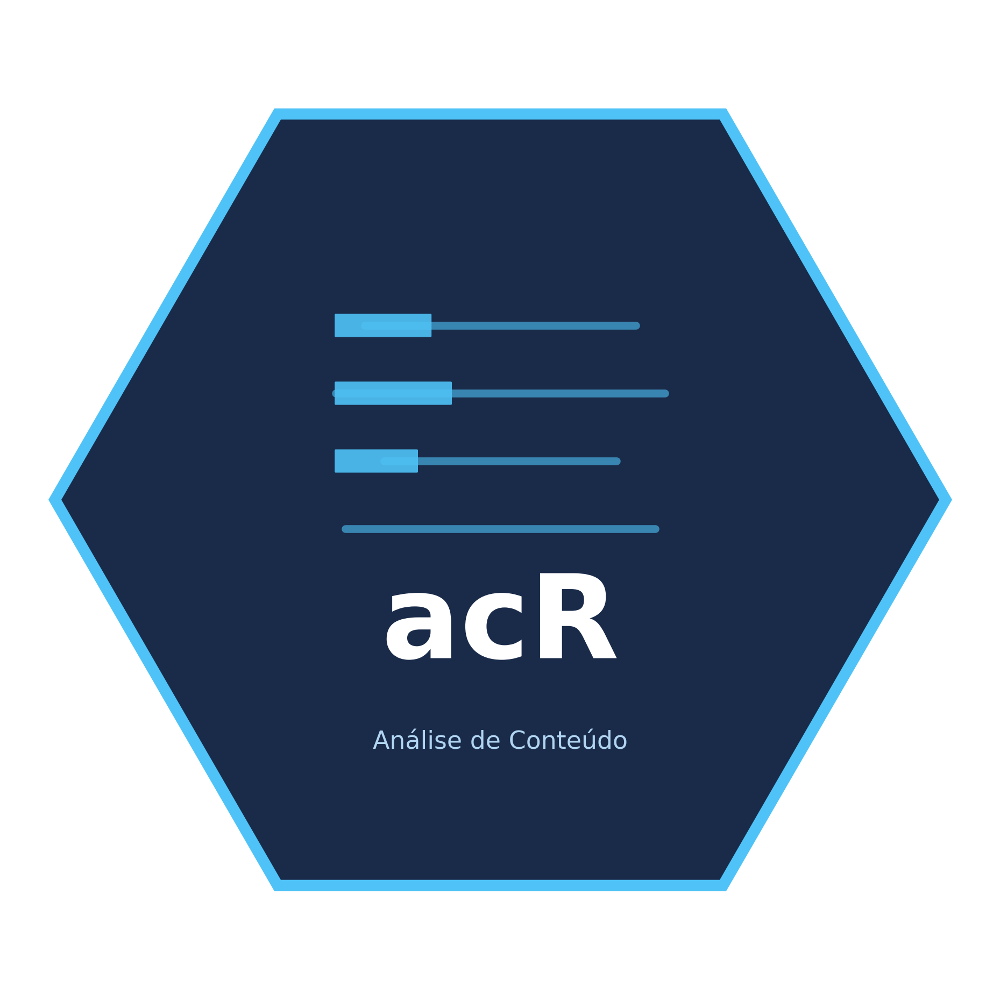

# acR 

<!-- badges: start -->
[](https://github.com/andersonheri/acR/actions/workflows/R-CMD-check.yaml)
[](https://andersonheri.github.io/acR/)
[](https://lifecycle.r-lib.org/articles/stages.html#experimental)
[](https://opensource.org/licenses/MIT)
<!-- badges: end -->

> **Analise de Conteudo em R**: pipeline integrado qualitativo (LLMs) e
> quantitativo, com visualizacoes modernas e foco em corpora brasileiros.

## Visao geral

O `acR` oferece um pipeline completo de analise de conteudo textual para
pesquisadores em ciencias sociais. O pacote integra dois modulos principais:
um **modulo qualitativo** baseado em LLMs (qwen3.6, GPT-4o, Claude, Groq)
para codificacao automatica com validacao humana, e um **modulo quantitativo**
para frequencias, TF-IDF, keyness, sentimento e modelagem de topicos (LDA).
Todas as funcoes foram projetadas para corpora em portugues e seguem as
convencoes metodologicas de Bardin (2011) e Krippendorff (2018).

## Instalacao

```r
# Versao de desenvolvimento (GitHub)
# install.packages("remotes")
remotes::install_github("andersonheri/acR")
```

## Exemplo minimo

### Modulo qualitativo — codificacao com LLM

```r
library(acR)

# 1. Corpus
corpus <- ac_corpus(
  c("Esta reforma beneficia os trabalhadores.",
    "O projeto gerara desemprego em massa.",
    "O artigo 3o estabelece prazo de 180 dias."),
  id = c("doc_1", "doc_2", "doc_3")
)

# 2. Codebook
codebook <- ac_qual_codebook(
  name         = "posicionamento",
  instructions = "Classifique o posicionamento do texto.",
  categories   = c("Favoravel", "Contrario", "Neutro/Tecnico"),
  mode         = "manual"
)

# 3. Codificar com qwen3.6 via Ollama
resultado <- ac_qual_code(
  corpus      = corpus,
  codebook    = codebook,
  provider    = "ollama",
  model       = "qwen3.6:latest",
  api_key     = Sys.getenv("OLLAMA_API_KEY"),
  temperature = 0
)

# 4. Exportar
ac_export(resultado, formato = "csv", arquivo = "codificacao.csv")
```

### Modulo quantitativo — frequencias e sentimento

```r
# Tokenizar e calcular frequencias
tokens   <- ac_tokenize(ac_clean(corpus), remover_stopwords = TRUE)
contagem <- ac_count(tokens)
ac_plot_top_terms(ac_top_terms(contagem, n = 10))

# Sentimento
sent <- ac_sentiment(corpus, lexico = "oplexicon")
ac_plot_sentiment(sent)
```

## Funcoes por modulo

### Corpus e pre-processamento

| Funcao | Descricao |
|--------|-----------|
| `ac_corpus()` | Criar objeto corpus |
| `ac_import()` | Importar corpus de arquivo externo |
| `ac_clean()` | Limpar texto (lowercase, pontuacao, numeros) |
| `is_ac_corpus()` | Verificar se objeto e um corpus acR |
| `ac_tokenize()` | Tokenizar com remocao de stopwords |

### Analise quantitativa

| Funcao | Descricao |
|--------|-----------|
| `ac_count()` | Frequencia de termos |
| `ac_top_terms()` | Top N termos |
| `ac_tf_idf()` | TF-IDF por documento |
| `ac_keyness()` | Vocabulario distintivo entre grupos |
| `ac_cooccurrence()` | Rede de co-ocorrencia |
| `ac_sentiment()` | Sentimento (OpLexicon / SentiLex-PT) |
| `ac_lda()` | Modelagem de topicos LDA |
| `ac_lda_tune()` | Selecao otima de K topicos |

### Analise qualitativa com LLMs

| Funcao | Descricao |
|--------|-----------|
| `ac_qual_codebook()` | Construir codebook estruturado |
| `ac_qual_code()` | Codificar corpus via LLM |
| `ac_qual_list_models()` | Listar modelos disponiveis |
| `ac_qual_recommend_model()` | Recomendacao automatica de modelo |
| `ac_qual_sample()` | Amostrar para validacao humana |
| `ac_qual_export_for_review()` | Exportar para revisao em .xlsx |
| `ac_qual_import_human()` | Importar revisao humana |
| `ac_qual_irr()` | Concordancia inter-codificador (kappa) |
| `ac_qual_reliability()` | Validar threshold de confiabilidade |
| `ac_qual_search_literature()` | Buscar literatura de apoio |
| `ac_qual_save_codebook()` | Salvar codebook em JSON |
| `ac_qual_load_codebook()` | Carregar codebook salvo |

### Visualizacao

| Funcao | Descricao |
|--------|-----------|
| `ac_plot_top_terms()` | Barras de frequencia |
| `ac_plot_tf_idf()` | TF-IDF por grupo |
| `ac_plot_keyness()` | Keyness por grupo de referencia |
| `ac_plot_sentiment()` | Distribuicao de sentimento |
| `ac_plot_xray()` | Evolucao de sentimento no texto |
| `ac_plot_lda_topics()` | Termos por topico LDA |
| `ac_plot_lda_tune()` | Curva de selecao de K |
| `ac_plot_cooccurrence()` | Rede de co-ocorrencia |
| `ac_wordcloud()` | Nuvem de palavras |
| `ac_plot_wordcloud_comparative()` | Nuvem comparativa por topico |

### Exportacao

| Funcao | Formatos |
|--------|---------|
| `ac_export()` | `csv`, `xlsx`, `latex`, `rds` |
| `ac_fetch_camara()` | Coleta via API da Camara dos Deputados |
| `ac_fetch_senado()` | Coleta via API do Senado Federal |

## Provedores LLM suportados

| Provedor | `provider` | Modelo recomendado | Portugues |
|----------|------------|--------------------|-----------|
| Ollama nuvem | `"ollama"` | `qwen3.6:latest` | Excelente |
| OpenAI | `"openai"` | `gpt-4o-mini` | Excelente |
| Anthropic | `"anthropic"` | `claude-3-5-sonnet` | Excelente |
| Groq | `"groq"` | `llama3-8b-8192` | Bom |
| Together AI | `"openai"` | `Qwen/Qwen3-235B-A22B` | Excelente |
| Qualquer API OpenAI-compativel | `"openai"` + `base_url` | — | Variavel |

## Documentacao

- **Site completo**: <https://andersonheri.github.io/acR/>
- **Vignettes**:
  - [Introducao ao acR](https://andersonheri.github.io/acR/articles/introducao-acR.html)
  - [Codificacao qualitativa com LLMs](https://andersonheri.github.io/acR/articles/qualitativo-llm.html)
  - [Analise de proposicoes legislativas](https://andersonheri.github.io/acR/articles/analise-proposicoes.html)
  - [Analise quantitativa](https://andersonheri.github.io/acR/articles/quantitativo.html)
  - [Analise de sentimento](https://andersonheri.github.io/acR/articles/sentimento.html)
  - [Modelagem de topicos LDA](https://andersonheri.github.io/acR/articles/lda.html)

## Como citar

```r
citation("acR")
```

```
Henrique, A. (2025). acR: Analise de Conteudo em R.
R package version 0.1.0.
Centro de Estudos da Metropole (CEM-Cepid) — Universidade de Sao Paulo.
https://andersonheri.github.io/acR/
```

## Referencias

Bardin, L. (2011). *Analise de conteudo*. Edicoes 70.

Benoit, K., et al. (2018). quanteda. *JOSS*, 3(30), 774. doi:10.21105/joss.00774

Blei, D. M., Ng, A. Y., & Jordan, M. I. (2003). Latent Dirichlet Allocation.
*JMLR*, 3, 993-1022.

Krippendorff, K. (2018). *Content Analysis* (4a ed.). SAGE.

Landis, J. R., & Koch, G. G. (1977). *Biometrics*, 33(1), 159-174.

Laver, M., Benoit, K., & Garry, J. (2003). *APSR*, 97(2), 311-331.

Maerz, S., & Benoit, K. (2025). *quallmer*. — inspiracao para o workflow LLM.

Sampaio, R. C., & Lycariao, D. (2021). *Analise de conteudo categorial*. Enap.

Souza, M., & Vieira, R. (2012). OpLexicon. *WASSA*. PUCRS.

Wickham, H., et al. (2025). *ellmer*. Posit. <https://ellmer.tidyverse.org/>

## Licenca

MIT © Anderson Henrique — Centro de Estudos da Metropole (CEM-Cepid),
Universidade de Sao Paulo.
