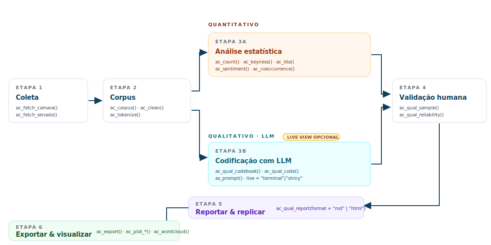

# acR 

<!-- badges: start -->
[](https://CRAN.R-project.org/package=acR)
[](https://github.com/andersonheri/acR/actions/workflows/R-CMD-check.yaml)
[](https://andersonheri.github.io/acR/)
[](https://lifecycle.r-lib.org/articles/stages.html#experimental)
[](https://opensource.org/licenses/MIT)
[](https://app.codecov.io/gh/andersonheri/acR)
<!-- badges: end -->

> **Análise de Conteúdo em R** — pipeline integrado qualitativo (LLMs) e
> quantitativo, com foco em corpora brasileiros e dados parlamentares.

<p align="center">
  
</p>

## Em uma linha

Do texto bruto ao resultado publicável — codebook, LLM, *keyness*, LDA, sentimento
e concordância inter-codificador, num único fluxo reprodutível.

## Para quem é

<table>
<tr>
<td width="33%" valign="top">

**Pesquisador social**  
Precisa codificar centenas de discursos e reportar *kappa*/Krippendorff no
método. O `acR` amostra estrategicamente, exporta para Excel e devolve as
métricas prontas.

</td>
<td width="33%" valign="top">

**Cientista político**  
Coleta discursos da Câmara/Senado, mede *keyness* entre partidos,
identifica frames com LDA e classifica posicionamento com LLM validado
por revisão humana.

</td>
<td width="34%" valign="top">

**Analista de políticas públicas**  
Monitora corpora de proposições e relatórios, produz nuvens, séries de
sentimento e tabelas resumo direto para o relatório final.

</td>
</tr>
</table>

## Comece em 3 linhas

```r
# 1. Instalar
install.packages("acR")           # via CRAN (em análise)
remotes::install_github("andersonheri/acR")  # ou versão dev

# 2. Importar seus documentos (PDF, docx, xlsx, csv, txt, imagens com OCR)
library(acR)
corpus <- ac_import("dados/*.pdf")          # ou "planilha.xlsx", "documento.docx"

# 3. Rodar o pipeline mínimo
ac_count(corpus) |> ac_top_terms(n = 10)

# 4. Codificar qualitativamente (requer chave de LLM)
codebook  <- ac_qual_codebook("posicao", "Classifique.",
                              categories = list(favor = "...", contra = "..."))
resultado <- ac_qual_code(corpus, codebook, model = "anthropic/claude-sonnet-4-5")
```

Vignette completa: **[Comece aqui →](https://andersonheri.github.io/acR/articles/introducao-acR.html)** ·
**[Quickstart 5 min →](https://andersonheri.github.io/acR/articles/quickstart.html)**

---

## O que o `acR` faz

**Módulo qualitativo.** Você escreve um *codebook* (categorias + definições + exemplos),
e a LLM classifica cada documento, reportando categoria, nível de confiança via
*self-consistency* e um raciocínio estruturado. Uma amostra é exportada para revisão
humana, e a concordância inter-codificador (percent agreement, Cohen's/Fleiss'
*kappa*, Krippendorff's *alpha*, Gwet's AC1, F1 macro) é calculada com IC via
*bootstrap*.

**Módulo quantitativo.** Ferramentas estatísticas clássicas de análise de conteúdo:
frequência de termos e por grupo, TF-IDF, *keyness* (χ²/*log-likelihood*), redes
de co-ocorrência com PMI, análise de sentimento em português (OpLexicon), modelagem
de tópicos com LDA e seleção automática de *k*. Visualizações prontas para
publicação em `ggplot2`, compatíveis com `ipeaplot`.

**Coleta nativa** de discursos da Câmara dos Deputados (por período, partido, UF)
e do Senado Federal (via `senatebR`).

## Fundamentação metodológica

O pipeline segue Sampaio e Lycarião (2021) — referência atual para análise de
conteúdo categorial no Brasil — e Krippendorff (2018). Bardin (2011) é reconhecida
como pioneira, mas o pacote privilegia abordagens metodologicamente atualizadas.
A camada de LLM é inspirada no `quallmer` (Maerz e Benoit, 2025) e comunica com
múltiplos provedores via `ellmer` (Wickham et al., 2025).

> **Status:** `acR` está em desenvolvimento ativo (submissão CRAN em andamento).
> Contribuições e feedback via [issues](https://github.com/andersonheri/acR/issues).

---

## Instalação

```r
# Após aprovação na CRAN (submissão em andamento):
install.packages("acR")

# Versão de desenvolvimento do GitHub:
# install.packages("remotes")
remotes::install_github("andersonheri/acR")

# O módulo qualitativo requer o ellmer para comunicação com LLMs
install.packages("ellmer")
```

---

## Pipeline qualitativo: do texto à classificação

### Passo 1 — Coletar discursos parlamentares

O `acR` tem funções nativas para coletar dados das APIs abertas da Câmara
dos Deputados e do Senado Federal. A coleta da Câmara é feita por período,
partido, UF e tipo de discurso, com paginação automática e tratamento de
erros de conexão. A coleta do Senado é viabilizada pelo pacote
[senatebR](https://github.com/vsntos/senatebR), de Vinicius Santos (UERJ),
cujas funções o `acR` estende com uma interface padronizada ao restante
do pipeline.

```r
library(acR)
library(ellmer)
library(dplyr)

# Coletar discursos plenários da Câmara — março de 2024
corpus_raw <- ac_fetch_camara(
  data_inicio   = "2024-03-11",
  data_fim      = "2024-03-15",
  tipo_discurso = "plenario",
  n_max         = 30L
)
```

### Passo 2 — Estruturar e limpar o corpus

O objeto `ac_corpus` é a unidade central do pacote, carregando o texto,
os metadados e o idioma do corpus, aceito por todas as funções de análise.

```r
corpus <- ac_corpus(
  corpus_raw,
  text  = texto,
  docid = id_discurso
)
```

A função `ac_clean()` aplica transformações configuráveis ao texto, com
controle granular sobre cada etapa. Antes de rodar a limpeza, o pesquisador
pode inspecionar e editar as stopwords com `ac_clean_stopwords()`:

```r
# Construir vetor de stopwords customizado a partir do preset legislativo
sw <- ac_clean_stopwords(
  preset = "pt-legislativo",
  add    = c("nobre", "ilustre", "respeitavel", "honrado"),
  remove = c("lei", "projeto", "constituicao")  # relevantes para a análise
)

# Limpeza com todas as opções
corpus_limpo <- ac_clean(
  corpus,
  lower               = TRUE,
  remove_punct        = TRUE,
  remove_url          = TRUE,
  remove_email        = TRUE,
  remove_hashtags     = TRUE,       # novo: remove #termos separado de símbolos
  remove_mentions     = TRUE,       # novo: remove @usuario separado de símbolos
  remove_stopwords    = "pt-legislativo",
  extra_stopwords     = sw,         # novo: stopwords adicionais ao preset
  protect             = c("PT", "PL", "CCJ"),  # siglas preservadas
  normalize_pt        = TRUE,
  custom_replacements = list(       # novo: substituições livres antes da limpeza
    "pres\\."  = "presidente",
    "dep\\."   = "deputado",
    "v\\.exa" = "vossa excelencia"
  ),
  min_char            = 3L,         # novo: descarta tokens com menos de 3 chars
  handle_na           = "remove",   # novo: remove documentos com texto NA
  verbose             = TRUE        # novo: exibe resumo da limpeza
)
```

O argumento `verbose = TRUE` exibe um resumo com tokens antes e depois,
quantos foram removidos por etapa e quantos documentos ficaram vazios após
a limpeza — útil para calibrar os parâmetros antes de rodar o pipeline
completo.

### Passo 3 — Definir o codebook

```r
codebook <- ac_qual_codebook(
  name         = "temas_plenario",
  instructions = "Classifique o tema principal do discurso parlamentar.",
  categories   = list(
    seguranca_publica  = list(
      definition = "Discursos sobre violência, polícia, crime e segurança pública."
    ),
    economia_fiscal    = list(
      definition = "Discursos sobre impostos, orçamento e política fiscal."
    ),
    politica_social    = list(
      definition = "Discursos sobre saúde, educação e assistência social."
    ),
    orientacao_votacao = list(
      definition = "Orientação de bancada para votação de projetos de lei."
    ),
    outros             = list(
      definition = "Discursos que não se encaixam nas categorias anteriores."
    )
  ),
  mode = "manual"
)
```

### Passo 4 — Classificar com LLM

```r
chat_obj <- chat_groq(
  model = "llama-3.3-70b-versatile",
  echo  = "none"
)

resultado <- ac_qual_code(
  corpus           = corpus_limpo,
  codebook         = codebook,
  chat             = chat_obj,
  confidence       = "total",
  k_consistency    = 3L,
  reasoning        = TRUE,
  reasoning_length = "short"
)
```

### Passo 5 — Validar com codificadores humanos

```r
amostra <- ac_qual_sample(resultado, n = 15, strategy = "uncertainty")
ac_qual_export_for_review(sample = amostra, path = "revisao.xlsx", corpus = corpus_limpo)

humano <- ac_qual_import_human("revisao.xlsx")
ac_qual_irr(gold = humano, predicted = resultado,
            id_col = "doc_id", cat_col = "categoria")
```

Os resultados de validação com 15 documentos produziram kappa de Cohen
de **0.70**, concordância substancial segundo Landis e Koch (1977),
comparável aos benchmarks de Gilardi, Alizadeh e Kubli (2023).

---

## Provedores de LLM suportados

O `acR` usa o pacote [ellmer](https://ellmer.tidyverse.org/) como backend,
o que significa que qualquer provedor suportado pelo ellmer funciona
diretamente via `chat =`. Isso inclui modelos comerciais (OpenAI, Anthropic,
Google, Mistral, DeepSeek), modelos locais via Ollama, e qualquer serviço
que implemente a interface compatível com a API da OpenAI, como instâncias
privadas ou servidores institucionais.

```r
chat_obj <- chat_groq(model = "llama-3.3-70b-versatile", echo = "none")
chat_obj <- chat_google_gemini(model = "gemini-2.5-flash", echo = "none")
chat_obj <- chat_ollama(model = "llama3.2", echo = "none")
chat_obj <- chat_openai(model = "gpt-4.1", echo = "none")
chat_obj <- chat_anthropic(model = "claude-sonnet-4-20250514", echo = "none")
```

As chaves de API devem ser configuradas no `.Renviron` com
`usethis::edit_r_environ()`, nunca diretamente no código.

---

## Busca de literatura via OpenAlex

```r
lit <- ac_qual_search_literature(
  concept       = "democratic backsliding",
  n_refs        = 5,
  journals      = "default",
  min_citations = 50,
  chat          = chat_obj
)
```

---

## Pipeline quantitativo

```r
tokens  <- ac_tokenize(corpus_limpo)
contagem <- ac_count(tokens)
ac_plot_top_terms(ac_top_terms(contagem, n = 15))

tfidf <- ac_tf_idf(ac_count(tokens, by = "partido"), by = "partido")
ac_plot_tf_idf(tfidf, by = "partido", n = 10)

keyness <- ac_keyness(tokens, target = "PT", ref = "PL")
ac_plot_keyness(keyness)

sent <- ac_sentiment(corpus_limpo)
ac_plot_sentiment(sent)

cooc <- ac_cooccurrence(tokens, window = 5, min_count = 2)
ac_plot_cooccurrence(cooc, top_n = 30)

lda  <- ac_lda(tokens, k = 5)
ac_plot_lda_topics(lda)
```

---

## Qual função eu preciso?

Um guia rápido do objetivo ao código. Cada linha aponta a função principal
e a vignette com o exemplo completo. As demais funções são variações ou
utilitários — veja **[Funções disponíveis (completo)](https://andersonheri.github.io/acR/reference/)**.

| Objetivo | Função | Vignette |
|---|---|---|
| Importar arquivos (PDF, Word, Excel, TXT, imagem com OCR) | `ac_import()` | [Quickstart](https://andersonheri.github.io/acR/articles/quickstart.html) |
| Criar corpus a partir de `data.frame` ou vetor | `ac_corpus()` | [Quickstart](https://andersonheri.github.io/acR/articles/quickstart.html) |
| Coletar discursos da Câmara/Senado | `ac_fetch_camara()` · `ac_fetch_senado()` | [Estudo de caso](https://andersonheri.github.io/acR/articles/analise-proposicoes.html) |
| Limpar texto (stopwords, URLs, acentos, NAs) | `ac_clean()` + `ac_clean_stopwords()` | [Quantitativo](https://andersonheri.github.io/acR/articles/quantitativo.html) |
| Contar tokens | `ac_count()` | [Quantitativo](https://andersonheri.github.io/acR/articles/quantitativo.html) |
| Top termos + gráfico | `ac_top_terms()` → `ac_plot_top_terms()` | [Quantitativo](https://andersonheri.github.io/acR/articles/quantitativo.html) |
| Termos distintivos por documento | `ac_tf_idf()` → `ac_plot_tf_idf()` | [Quantitativo](https://andersonheri.github.io/acR/articles/quantitativo.html) |
| Comparar grupos (governo × oposição) | `ac_keyness()` → `ac_plot_keyness()` | [Quantitativo](https://andersonheri.github.io/acR/articles/quantitativo.html) |
| Nuvem de palavras (ggwordcloud) | `ac_wordcloud()` | [Quantitativo §6](https://andersonheri.github.io/acR/articles/quantitativo.html#nuvem-de-palavras) |
| Nuvem comparativa entre 2 grupos | `ac_plot_wordcloud_comparative()` | [Quantitativo §6.1](https://andersonheri.github.io/acR/articles/quantitativo.html#nuvem-de-palavras) |
| Mapear onde termos aparecem no texto | `ac_plot_xray()` | [Quantitativo](https://andersonheri.github.io/acR/articles/quantitativo.html) |
| Rede de coocorrência | `ac_cooccurrence()` → `ac_plot_cooccurrence()` | [Quantitativo](https://andersonheri.github.io/acR/articles/quantitativo.html) |
| Análise de sentimento (OpLexicon) | `ac_sentiment()` → `ac_plot_sentiment()` | [Sentimento](https://andersonheri.github.io/acR/articles/sentimento.html) |
| Modelagem de tópicos (LDA) | `ac_lda()` → `ac_plot_lda_topics()` | [LDA](https://andersonheri.github.io/acR/articles/lda.html) |
| Cluster de documentos (hclust, k-means, PAM) | `ac_cluster_documents()` → `ac_plot_cluster()` | [Cluster](https://andersonheri.github.io/acR/articles/cluster.html) |
| Criar codebook para LLM | `ac_qual_codebook()` | [Qualitativo LLM](https://andersonheri.github.io/acR/articles/qualitativo-llm.html) |
| Classificar textos com LLM | `ac_qual_code()` | [Qualitativo LLM](https://andersonheri.github.io/acR/articles/qualitativo-llm.html) |
| Amostrar documentos para revisão humana | `ac_qual_sample()` · `ac_qual_export_for_review()` | [Qualitativo LLM](https://andersonheri.github.io/acR/articles/qualitativo-llm.html) |
| Concordância humano × LLM (Kappa, Krippendorff) | `ac_qual_irr()` · `ac_qual_reliability()` | [Qualitativo LLM](https://andersonheri.github.io/acR/articles/qualitativo-llm.html) |
| Escolher o modelo LLM certo | `ac_qual_recommend_model()` | [Qualitativo LLM](https://andersonheri.github.io/acR/articles/qualitativo-llm.html) |
| Relatório metodológico reprodutível | `ac_qual_report()` | [Replicabilidade](https://andersonheri.github.io/acR/articles/replicabilidade.html) |
| Exportar (CSV, LaTeX, Excel, RDS) | `ac_export()` | [Replicabilidade](https://andersonheri.github.io/acR/articles/replicabilidade.html) |

---

## Cobertura de testes

Suite de **360 blocos `test_that`** com 655 assertions, cobrindo
**~55%** do código (medido com `covr::package_coverage()`). Testes de
integração com APIs externas (Câmara, Senado, LLM) usam `skip_on_cran()`
e verificação prévia de disponibilidade — não bloqueiam CI offline nem
o `R CMD check` da CRAN.

---

## Documentação

Site completo: **<https://andersonheri.github.io/acR/>** — vignettes navegáveis,
referência de todas as funções e changelog.

### Comece por aqui

- [Quickstart (5 min)](https://andersonheri.github.io/acR/articles/quickstart.html) — do zero ao primeiro gráfico.
- [Visão geral do pacote](https://andersonheri.github.io/acR/articles/introducao-acR.html) — pipeline em uma hora.
- [Replicabilidade ponta-a-ponta](https://andersonheri.github.io/acR/articles/replicabilidade.html) — do dado bruto ao relatório reprodutível.

### Pipeline qualitativo (LLMs)

- [Codificação com LLMs — guia completo](https://andersonheri.github.io/acR/articles/qualitativo-llm.html) — codebook, self-consistency, revisão humana e concordância.
- [Estudo de caso: proposições legislativas](https://andersonheri.github.io/acR/articles/analise-proposicoes.html) — aplicação real com dados da Câmara.

### Pipeline quantitativo

- [Frequências, keyness e coocorrência](https://andersonheri.github.io/acR/articles/quantitativo.html) — inclui nuvens de palavras (ggwordcloud), comparativa entre grupos, TF-IDF por tema, coocorrência com PMI/heatmap.
- [Agrupamento não supervisionado de documentos](https://andersonheri.github.io/acR/articles/cluster.html) — hclust, k-means, PAM; 6 visualizações e comparação lado-a-lado com LDA.
- [Análise de sentimento (OpLexicon)](https://andersonheri.github.io/acR/articles/sentimento.html) — polaridade e sentimento agregado por documento.
- [Modelagem de tópicos (LDA)](https://andersonheri.github.io/acR/articles/lda.html) — escolha de `k`, interpretação de tópicos e visualização.

### Referência de funções

- [Índice completo por área](https://andersonheri.github.io/acR/reference/) — Coleta, Corpus, Análise qualitativa (LLM), Análise quantitativa, Validação e confiabilidade, Visualização, Replicabilidade, Exportação.
- [Notícias / changelog](https://andersonheri.github.io/acR/news/) — histórico de versões (atual: **0.3.1**).

---

## Como citar

```r
citation("acR")
```

```
Henrique, A. (2026). acR: Análise de Conteúdo em R.
R package version 0.3.1. ORCID: 0000-0002-1842-2725.
Centro de Estudos da Metrópole (CEM-Cepid) — Universidade de São Paulo.
https://andersonheri.github.io/acR/
```

---

## Referências

Bardin, L. (2011). *Análise de conteúdo*. Edições 70.

Gilardi, F., Alizadeh, M., & Kubli, M. (2023). ChatGPT outperforms crowd
workers for text-annotation tasks. *PNAS*, 120(30).

Gwet, K. L. (2014). *Handbook of Inter-Rater Reliability*. 4. ed. Advanced
Analytics.

Krippendorff, K. (2018). *Content Analysis: An Introduction to Its
Methodology*. 4. ed. SAGE.

Landis, J. R., & Koch, G. G. (1977). The measurement of observer agreement
for categorical data. *Biometrics*, 33(1), 159–174.

Maerz, S. F., & Benoit, K. (2025). *quallmer: Qualitative Analysis with
Large Language Models*. R package version 0.3.0.
<https://quallmer.github.io/quallmer/>

Priem, J. et al. (2022). OpenAlex: A fully-open index of the global research
system. *arXiv*, 2205.01833.

Sampaio, R. C., & Lycarião, D. (2021). *Análise de conteúdo categorial:
manual de aplicação*. Brasília: ENAP.
<https://repositorio.enap.gov.br/handle/1/6542>

Santos, V. (2024). *senatebR: Functions to collect data from the Brazilian
Senate*. R package version 0.1.0. <https://github.com/vsntos/senatebR>

Souza, M., & Vieira, R. (2012). Sentiment analysis on Twitter data for
Portuguese language. *PROPOR*.

Wang, X. et al. (2023). Self-consistency improves chain of thought reasoning
in language models. *EMNLP*.

Wickham, H. et al. (2025). *ellmer: Chat with Large Language Models*. Posit.
<https://ellmer.tidyverse.org>

---

## Licença

MIT © Anderson Henrique ([ORCID: 0000-0002-1842-2725](https://orcid.org/0000-0002-1842-2725)) —
Centro de Estudos da Metrópole (CEM-Cepid), Universidade de São Paulo.
