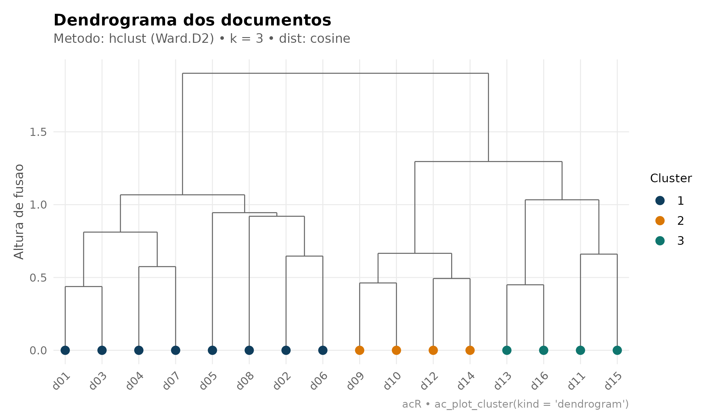
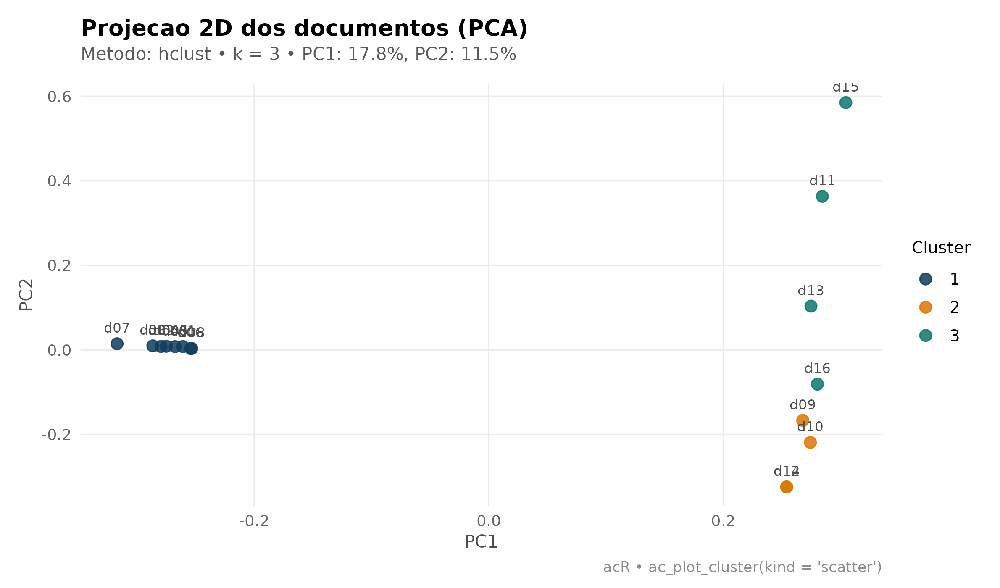
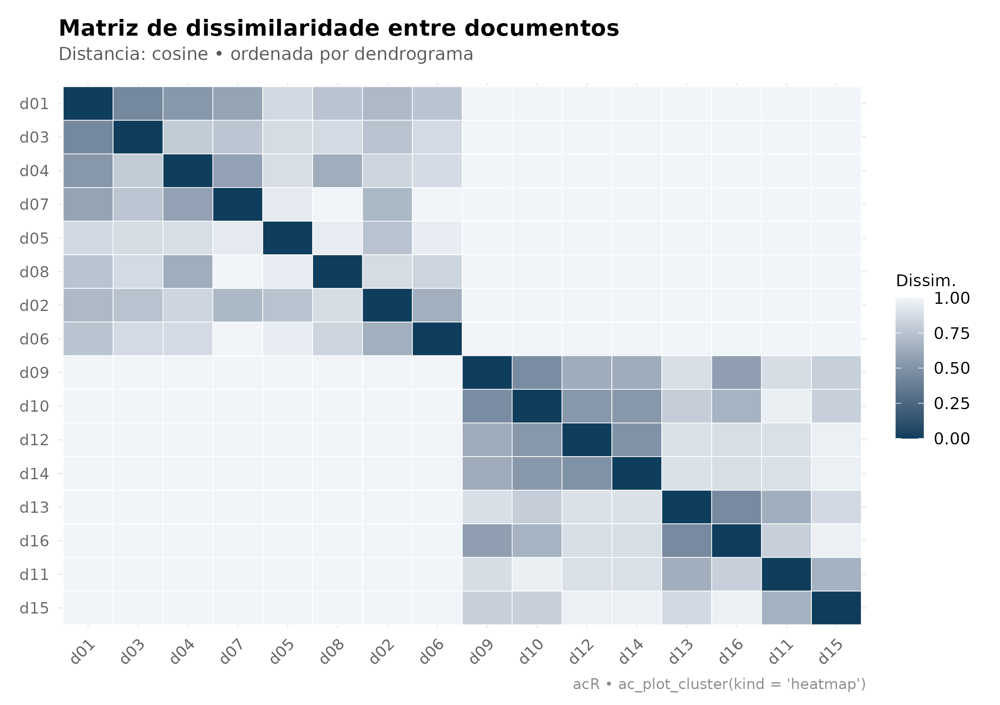
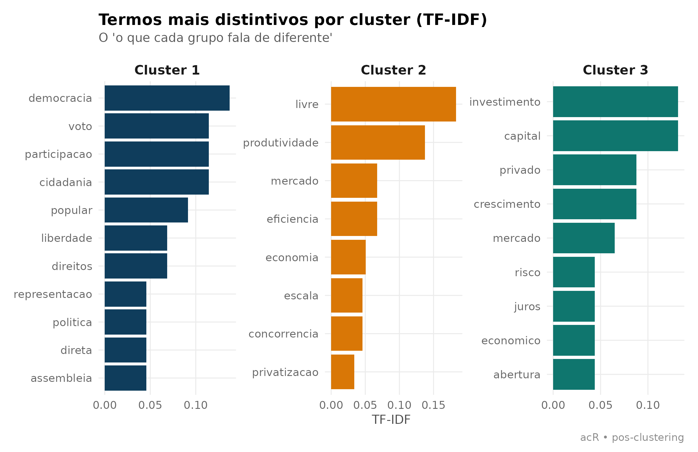
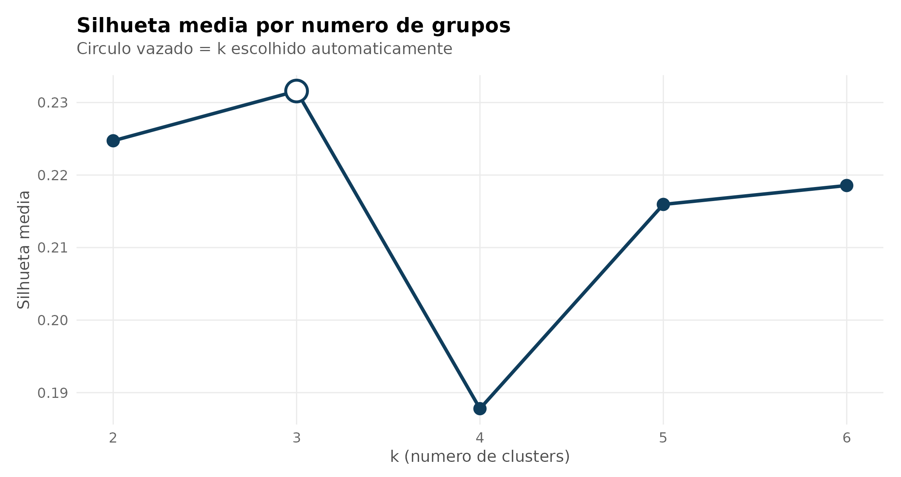
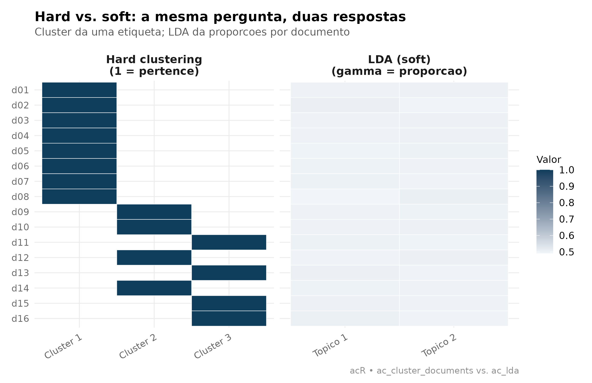
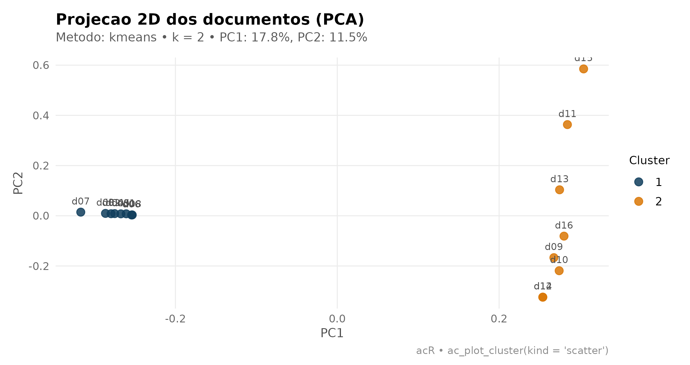

# Agrupamento não supervisionado de documentos

## Por que agrupar documentos?

Nem toda pesquisa começa com um livro de códigos pronto. Às vezes você
tem centenas de discursos, proposições ou entrevistas e precisa
**descobrir tipologias latentes** — antes de rotular, antes de contar,
antes de qualquer LLM. É aí que entra o *clustering*: um algoritmo lê a
matriz de vocabulário e devolve **uma etiqueta por documento**,
agrupando o que se parece por co-ocorrência de termos.

## 1. Três famílias, três leituras teóricas

Antes de rodar qualquer código, vale entender que “descobrir grupos em
texto” é uma família de técnicas com **três leituras teóricas
diferentes**, cada uma respondendo a uma pergunta distinta:

### 1.1 Hard clustering (o que esta vignette faz)

Cada documento pertence a **um único grupo**. A saída é uma etiqueta
`cluster ∈ {1, 2, …, k}`. É o mundo do
[`ac_cluster_documents()`](https://andersonheri.github.io/acR/reference/ac_cluster_documents.md):
hierárquico (`hclust`), `kmeans` e `pam`.

- **Modelo mental:** cada documento é *do* tipo A ou *do* tipo B.
- **Pergunta:** “que tipologias existem no corpus?”
- **Boa para:** amostragem estratificada, dendrogramas metodológicos,
  triagem antes de codificação qualitativa, criação de estratos para
  análise comparativa.

### 1.2 Soft (fuzzy) clustering

Cada documento tem um **vetor de graus de pertencimento** que soma 1
entre `k` clusters. Um documento “60% tipo A, 40% tipo B” existe. Fuzzy
c-means (`e1071::cmeans()`) e misturas gaussianas (`mclust`) são os
exemplos clássicos.

- **Modelo mental:** documentos são pontos numa **zona cinzenta** entre
  protótipos.
- **Pergunta:** “quão típico deste grupo cada documento é?”
- **Boa para:** identificar documentos *fronteiriços* (bons candidatos a
  revisão humana), ranquear documentos por representatividade dentro de
  um grupo.

### 1.3 Modelos de tópicos (LDA)

Cada documento é uma **mistura probabilística de tópicos**, e cada
tópico é uma **distribuição sobre palavras**. É o mundo do
[`ac_lda()`](https://andersonheri.github.io/acR/reference/ac_lda.md): o
output é uma matriz **γ (gamma)** de probabilidades documento × tópico e
uma matriz **β (beta)** de probabilidades tópico × palavra.

- **Modelo mental:** o autor amostrou tópicos com certas proporções e,
  para cada palavra, sorteou um tópico e depois uma palavra dele.
- **Pergunta:** “que temas coexistem em cada documento e como eles se
  compõem?”
- **Boa para:** discurso parlamentar, artigos jornalísticos, textos
  longos com múltiplos temas por documento.

### 1.4 Como escolher?

| Se você quer… | Use |
|----|----|
| Uma partição limpa, uma etiqueta por documento | Hard clustering (esta vignette) |
| Detectar documentos fronteiriços, quão típico de um grupo cada é | Soft clustering (fuzzy c-means) |
| Descobrir temas que se **misturam** em cada texto | LDA (veja [`vignette("lda")`](https://andersonheri.github.io/acR/articles/lda.md)) |
| Rotular documentos com **categorias pré-definidas** por um pesquisador | LLM (veja [`vignette("qualitativo-llm")`](https://andersonheri.github.io/acR/articles/qualitativo-llm.md)) |

Um bom pipeline muitas vezes **combina** essas técnicas: hard clustering
para triagem inicial, LDA para entender temas dentro de cada grupo, LLM
para codificar categorias teoricamente motivadas, revisão humana nos
documentos que caírem em fronteiras.

## 2. Um corpus de dois blocos

Para tornar o exemplo transparente, vamos construir um corpus com **dois
blocos temáticos** deliberadamente separados: democracia participativa
de um lado, economia de mercado do outro. O clustering deve, sem
supervisão, reencontrar essa divisão.

``` r

df <- data.frame(
  id = paste0("d", sprintf("%02d", 1:16)),
  tema_real = rep(c("democracia", "mercado"), each = 8),
  texto = c(
    "democracia participacao voto liberdade cidadania popular",
    "cidadania direitos participacao democracia representacao politica",
    "voto direitos liberdade cidadania soberania popular",
    "democracia voto participacao popular assembleia direta",
    "participacao social democracia direitos coletivos comunidade",
    "cidadania voto democracia representacao plural minorias",
    "liberdade participacao politica assembleia popular deliberacao",
    "democracia direta cidadania voto plebiscito referendo",
    "mercado economia eficiencia privatizacao competicao livre",
    "privatizacao mercado livre eficiencia produtividade lucro",
    "economia crescimento investimento mercado capital juros",
    "eficiencia mercado economia livre concorrencia produtividade",
    "mercado privado investimento economia lucro capital risco",
    "economia livre mercado eficiencia produtividade escala",
    "crescimento economico mercado investimento privatizacao abertura",
    "mercado competicao eficiencia lucro capital privado"
  ),
  stringsAsFactors = FALSE
)

corpus <- ac_corpus(df, text = texto, docid = id)
corpus
#> # A tibble: 16 × 3
#>   doc_id text                                                          tema_real
#>   <chr>  <chr>                                                         <chr>    
#> 1 d01    democracia participacao voto liberdade cidadania popular      democrac…
#> 2 d02    cidadania direitos participacao democracia representacao pol… democrac…
#> 3 d03    voto direitos liberdade cidadania soberania popular           democrac…
#> 4 d04    democracia voto participacao popular assembleia direta        democrac…
#> 5 d05    participacao social democracia direitos coletivos comunidade  democrac…
#> 6 d06    cidadania voto democracia representacao plural minorias       democrac…
#> # ℹ 10 more rows
```

Guardei `tema_real` fora do corpus para poder validar depois: o
clustering **não vê** essa coluna; só o texto.

## 3. Ajuste em três linhas

``` r

clust <- ac_cluster_documents(corpus)
clust
#> 
#> Documentos por cluster:
#> 
#> 1 2 3 
#> 8 4 4
```

Os padrões cobrem 80% dos casos:

- **hclust + Ward.D2** — hierárquico, produz dendrograma interpretável.
- **TF-IDF** — palavras raras e discriminantes contam mais.
- **Distância cosseno** — o clássico em texto (invariante a tamanho de
  documento).
- **`k` automático por silhueta** — testa `k ∈ {2, …, 8}` e escolhe o
  melhor (requer pacote `cluster`).

## 4. Seis formas de olhar para o mesmo cluster

### 4.1 Dendrograma — a árvore das fusões

Mostra a ordem em que documentos foram unidos e a **altura** de cada
fusão. Cortes altos separam grupos sólidos; cortes baixos indicam
agrupamentos frouxos.

``` r

ac_plot_cluster(clust, kind = "dendrogram")
```



### 4.2 Projeção PCA — a geometria do corpus

Cada documento vira um ponto no plano das duas componentes principais.
Documentos com vocabulário parecido ficam próximos; a cor mostra a
divisão do algoritmo.

``` r

ac_plot_cluster(clust, kind = "scatter")
```



### 4.3 Mapa de calor — a assinatura da separação

Ordena os documentos pelo dendrograma e desenha a matriz de
dissimilaridade inteira. **Blocos escuros na diagonal** são o carimbo de
qualidade de um clustering bem-sucedido.

``` r

ac_plot_cluster(clust, kind = "heatmap")
```



### 4.4 Termos mais distintivos por cluster

Este gráfico responde à pergunta que interessa depois de rodar o modelo:
**“o que cada grupo *fala* de diferente?”**. Juntamos a etiqueta do
cluster ao TF-IDF e mostramos os 8 termos mais fortes por grupo.

``` r

tokens_com_cluster <- corpus |>
  ac_clean() |>
  ac_count() |>
  left_join(clust$assignments, by = "doc_id") |>
  group_by(cluster, token) |>
  summarise(n = sum(n), .groups = "drop") |>
  rename(doc_id = cluster) |>
  mutate(doc_id = paste0("Cluster ", doc_id))

tfidf_cluster <- ac_tf_idf(tokens_com_cluster)

top_por_cluster <- tfidf_cluster |>
  group_by(doc_id) |>
  slice_max(tf_idf, n = 8) |>
  ungroup() |>
  mutate(token = tidytext::reorder_within(token, tf_idf, doc_id))

ggplot(top_por_cluster, aes(tf_idf, token, fill = doc_id)) +
  geom_col(show.legend = FALSE) +
  tidytext::scale_y_reordered() +
  facet_wrap(~ doc_id, scales = "free") +
  scale_fill_manual(values = ac_palette(clust$k)) +
  labs(
    title    = "Termos mais distintivos por cluster (TF-IDF)",
    subtitle = "O 'o que cada grupo fala de diferente'",
    x = "TF-IDF", y = NULL,
    caption = "acR • pos-clustering"
  ) +
  theme_ac()
```



### 4.5 Curva de silhueta — escolhendo `k` visualmente

Quando o `k` automático parecer arbitrário, olhe para a curva. A
silhueta média de cada `k` diz o quão *coeso* é o agrupamento naquele
número de grupos. Picos claros são bons; platôs indicam que a divisão
seguinte é quase tão boa quanto.

``` r

if (requireNamespace("cluster", quietly = TRUE)) {
  ks   <- 2:6
  sils <- vapply(ks, function(k_try) {
    ac_cluster_documents(corpus, k = k_try)$silhouette
  }, numeric(1))

  df_sil <- data.frame(k = ks, silhueta = sils)

  ggplot(df_sil, aes(k, silhueta)) +
    geom_line(color = ac_palette(1), linewidth = 1.1) +
    geom_point(size = 3.5, color = ac_palette(1)) +
    geom_point(
      data = df_sil[which.max(df_sil$silhueta), ],
      aes(k, silhueta),
      size = 6, shape = 21, stroke = 1.4,
      fill = "white", color = ac_palette(1)
    ) +
    scale_x_continuous(breaks = ks) +
    labs(
      title    = "Silhueta media por numero de grupos",
      subtitle = "Circulo vazado = k escolhido automaticamente",
      x = "k (numero de clusters)", y = "Silhueta media"
    ) +
    theme_ac()
}
```



### 4.6 Hard vs. soft — comparando com LDA

Este é o gráfico mais **didático** da vignette: mostra lado a lado como
hard clustering e LDA veem o mesmo corpus. À esquerda, cada linha do
heatmap é um documento e cada coluna, o cluster ao qual ele pertence
(binário: 0 ou 1). À direita, cada linha é o mesmo documento e cada
coluna é a proporção γ do tópico LDA — **um gradiente contínuo**.

``` r

lda_fit <- ac_lda(corpus, k = 2, seed = 42)

hard <- clust$assignments |>
  mutate(valor = 1, tipo = paste0("Cluster ", cluster)) |>
  select(doc_id, tipo, valor)

soft <- lda_fit$documents |>
  mutate(tipo = paste0("Topico ", topic), valor = gamma) |>
  select(doc_id, tipo, valor)

plot_df <- bind_rows(
  hard |> mutate(painel = "Hard clustering\n(1 = pertence)"),
  soft |> mutate(painel = "LDA (soft)\n(gamma = proporcao)")
) |>
  mutate(doc_id = factor(doc_id, levels = rev(sort(unique(doc_id)))))

ggplot(plot_df, aes(tipo, doc_id, fill = valor)) +
  geom_tile(color = "white") +
  facet_wrap(~ painel, scales = "free_x") +
  scale_fill_gradient(low = "#F1F5F9", high = ac_palette(1), name = "Valor") +
  labs(
    title    = "Hard vs. soft: a mesma pergunta, duas respostas",
    subtitle = "Cluster da uma etiqueta; LDA da proporcoes por documento",
    x = NULL, y = NULL,
    caption = "acR • ac_cluster_documents vs. ac_lda"
  ) +
  theme_ac() +
  theme(axis.text.x = element_text(angle = 30, hjust = 1))
```



Note como o hard clustering sempre pinta uma célula por linha (o
documento é *do* grupo A ou *do* grupo B), enquanto o LDA distribui
massa — a maior parte dos documentos é ~90% de um tópico, mas alguns
ficam repartidos. **É a mesma tipologia latente, expressa em duas
métricas diferentes.**

## 5. Validando contra a verdade

Como guardamos `tema_real` fora do modelo, dá para conferir a acurácia
da partição:

``` r

validacao <- clust$assignments |>
  mutate(tema_real = df$tema_real[match(doc_id, df$id)]) |>
  count(tema_real, cluster)
validacao
#> # A tibble: 3 × 3
#>   tema_real  cluster     n
#>   <chr>        <int> <int>
#> 1 democracia       1     8
#> 2 mercado          2     4
#> 3 mercado          3     4
```

Se o algoritmo separou corretamente, cada `tema_real` deve concentrar-se
num único cluster (permutação de rótulos é esperada — o clustering não
sabe qual grupo é “democracia” ou “mercado”, só que são diferentes).

## 6. Escolhendo o método

[`ac_cluster_documents()`](https://andersonheri.github.io/acR/reference/ac_cluster_documents.md)
aceita três algoritmos:

| Método | Quando usar |
|----|----|
| `hclust` | Padrão. Você quer dendrograma, ou não sabe `k` de antemão. |
| `kmeans` | Corpus grande (milhares de documentos), você já sabe `k`, quer rapidez. |
| `pam` | Robusto a *outliers*; devolve medoides reais (documentos exemplares). |

`pam` requer o pacote `cluster` instalado; os demais rodam com apenas o
`stats` base.

``` r

clust_km <- ac_cluster_documents(corpus, method = "kmeans", k = 2)
ac_plot_cluster(clust_km, kind = "scatter")
```



## 7. E depois? Integrando com o pipeline

Fluxo típico onde clustering é **etapa prévia**:

1.  [`ac_cluster_documents()`](https://andersonheri.github.io/acR/reference/ac_cluster_documents.md)
    particiona o corpus em `k` grupos.
2.  Amostre `n` documentos por cluster para leitura humana.
3.  Use as leituras para escrever um **codebook inicial** com
    [`ac_qual_codebook()`](https://andersonheri.github.io/acR/reference/ac_qual_codebook.md).
4.  Aplique o codebook ao corpus inteiro com
    [`ac_qual_code()`](https://andersonheri.github.io/acR/reference/ac_qual_code.md).
5.  Se quiser refinar temas *dentro* de um cluster, rode
    [`ac_lda()`](https://andersonheri.github.io/acR/reference/ac_lda.md)
    só naquele subcorpus.

Isso reduz o custo cognitivo do primeiro contato com o corpus: em vez de
enfrentar centenas de documentos aleatórios, você lê um punhado de
exemplares de cada tipologia latente.

## Referências

- Blei, D. M., Ng, A. Y., & Jordan, M. I. (2003). Latent Dirichlet
  Allocation. *JMLR*, 3, 993–1022. — o paper original do LDA.
- Bezdek, J. C. (1981). *Pattern Recognition with Fuzzy Objective
  Function Algorithms*. Plenum. — fuzzy c-means.
- Kaufman, L. & Rousseeuw, P. J. (1990). *Finding Groups in Data*.
  Wiley. — PAM e silhueta.
- Manning, C., Raghavan, P. & Schütze, H. (2008). *Introduction to
  Information Retrieval*. Cambridge University Press. Cap. 16–17.
- Murtagh, F. & Legendre, P. (2014). Ward’s hierarchical agglomerative
  clustering method: Which algorithms implement Ward’s criterion?
  *Journal of Classification*, 31(3), 274–295.
