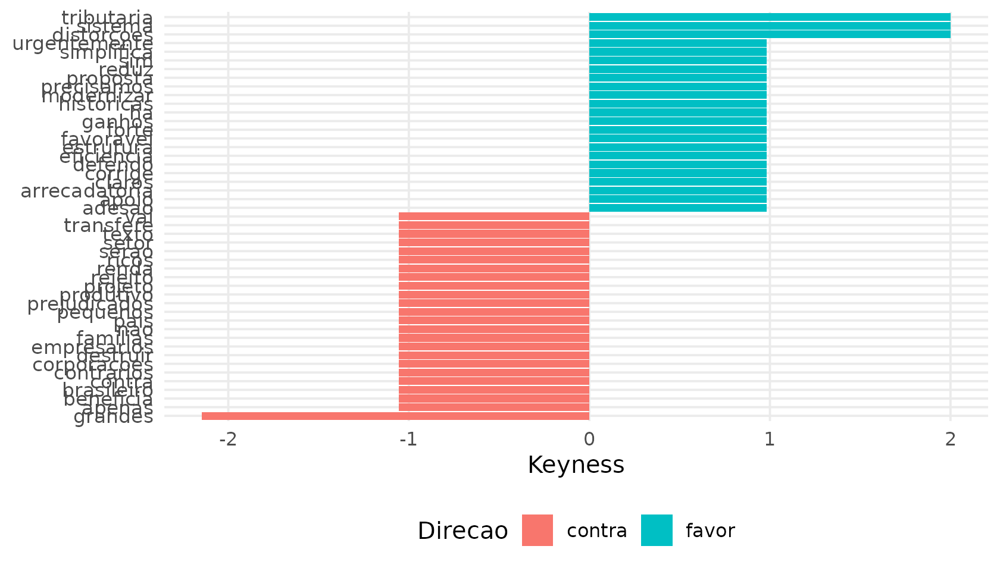
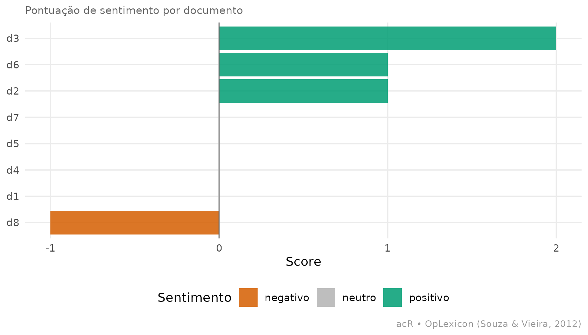

# Introdução ao acR: pipeline integrado de análise de conteúdo

Esta vignette percorre o pipeline completo do `acR` em um exemplo
pequeno mas realista — discursos parlamentares favoráveis e contrários a
uma reforma — mostrando o *output* efetivo de cada etapa. Se você
prefere um tour de 5 minutos com só o essencial, veja o
**[Quickstart](https://andersonheri.github.io/acR/articles/quickstart.md)**.

``` r

library(acR)
```

## O objeto central: `ac_corpus`

Tudo no `acR` gira em torno do `ac_corpus`, um `tibble` com colunas
padronizadas `doc_id` e `text` que carrega quaisquer metadados
adicionais. As demais funções aceitam esse objeto diretamente.

``` r

df <- data.frame(
  id      = paste0("d", 1:8),
  texto   = c(
    "Sou favoravel a reforma tributaria: simplifica o sistema e reduz distorcoes.",
    "Voto contra: essa reforma vai destruir o setor produtivo brasileiro.",
    "Apoio a proposta com forte adesao, ha ganhos claros de eficiencia arrecadatoria.",
    "Rejeito o texto: transfere renda das familias para grandes corporacoes.",
    "Defendo a reforma que corrige as distorcoes historicas do nosso sistema.",
    "Somos contrarios: o projeto beneficia apenas os mais ricos do pais.",
    "Voto sim, precisamos modernizar urgentemente a estrutura tributaria.",
    "Voto nao, os pequenos empresarios serao os grandes prejudicados."
  ),
  partido = c("PT","PL","PT","PL","PT","PL","PT","PL"),
  posicao = c("favor","contra","favor","contra","favor","contra","favor","contra"),
  stringsAsFactors = FALSE
)

corpus <- ac_corpus(df, text = texto, docid = id, meta = c(partido, posicao))
corpus
#> 
#> ── Corpus acR ──────────────────────────────────────────────────────────────────
#> • Documentos: 8
#> • Metadados: 2 colunas
#> • Idioma: "pt"
#> 
#> # A tibble: 8 × 4
#>   doc_id text                                                    partido posicao
#>   <chr>  <chr>                                                   <chr>   <chr>  
#> 1 d1     Sou favoravel a reforma tributaria: simplifica o siste… PT      favor  
#> 2 d2     Voto contra: essa reforma vai destruir o setor produti… PL      contra 
#> 3 d3     Apoio a proposta com forte adesao, ha ganhos claros de… PT      favor  
#> 4 d4     Rejeito o texto: transfere renda das familias para gra… PL      contra 
#> 5 d5     Defendo a reforma que corrige as distorcoes historicas… PT      favor  
#> 6 d6     Somos contrarios: o projeto beneficia apenas os mais r… PL      contra 
#> # ℹ 2 more rows
```

## 1. Frequências e termos salientes

Antes de contar, precisamos **remover stopwords**. Sem essa etapa, os
termos mais frequentes seriam `o`, `a`, `de`, `que` — carregam pouca
informação temática e mascaram os padrões reais do corpus.

``` r

corpus_limpo <- ac_clean(corpus, remove_stopwords = "pt")

# Frequência global
freq <- ac_count(corpus_limpo)
ac_top_terms(freq, n = 8)
#> # A tibble: 57 × 3
#>    doc_id token             n
#>    <chr>  <chr>         <int>
#>  1 d3     adesao            1
#>  2 d6     apenas            1
#>  3 d3     apoio             1
#>  4 d3     arrecadatoria     1
#>  5 d6     beneficia         1
#>  6 d2     brasileiro        1
#>  7 d3     claros            1
#>  8 d2     contra            1
#>  9 d6     contrarios        1
#> 10 d4     corporacoes       1
#> # ℹ 47 more rows
```

Agora quebrando por lado (`favor` vs `contra`):

``` r

freq_lado <- ac_count(corpus_limpo, by = "posicao")
ac_top_terms(freq_lado, n = 5, by = "posicao")
#> # A tibble: 51 × 3
#>    posicao token           n
#>    <chr>   <chr>       <int>
#>  1 contra  grandes         2
#>  2 contra  voto            2
#>  3 contra  apenas          1
#>  4 contra  beneficia       1
#>  5 contra  brasileiro      1
#>  6 contra  contra          1
#>  7 contra  contrarios      1
#>  8 contra  corporacoes     1
#>  9 contra  destruir        1
#> 10 contra  empresarios     1
#> # ℹ 41 more rows
```

## 2. Termos distintivos com *keyness*

Quais palavras aparecem **muito mais** em um grupo do que no outro? A
métrica `chi2` (χ²) mede essa distintividade.

``` r

key <- ac_keyness(freq_lado, group = "posicao", target = "favor")
head(key, 6)
#> # A tibble: 6 × 10
#>   token group target reference n_target n_reference total_target total_reference
#>   <chr> <chr> <chr>  <chr>        <dbl>       <dbl>        <dbl>           <dbl>
#> 1 dist… posi… favor  contra           2           0           29              28
#> 2 sist… posi… favor  contra           2           0           29              28
#> 3 trib… posi… favor  contra           2           0           29              28
#> 4 ades… posi… favor  contra           1           0           29              28
#> 5 apoio posi… favor  contra           1           0           29              28
#> 6 arre… posi… favor  contra           1           0           29              28
#> # ℹ 2 more variables: keyness <dbl>, direction <chr>
```

Visualização compacta dos termos mais distintivos:

``` r

if (requireNamespace("ggplot2", quietly = TRUE)) {
  ac_plot_keyness(key, n = 6)
}
```



## 3. Sentimento por documento (OpLexicon)

Escore agregado de polaridade de cada documento, usando o léxico
OpLexicon (Souza e Vieira, 2012):

``` r

sent <- ac_sentiment(corpus)
sent
#> # A tibble: 8 × 6
#>   doc_id n_pos n_neg n_neu score sentiment
#>   <chr>  <int> <int> <int> <int> <chr>    
#> 1 d1         0     0    11     0 neutro   
#> 2 d2         1     0     9     1 positivo 
#> 3 d3         2     0    10     2 positivo 
#> 4 d4         0     0    10     0 neutro   
#> 5 d5         0     0    11     0 neutro   
#> 6 d6         1     0    10     1 positivo 
#> 7 d7         0     0     8     0 neutro   
#> 8 d8         0     1     8    -1 negativo
```

Visualizando por documento:

``` r

if (requireNamespace("ggplot2", quietly = TRUE)) {
  ac_plot_sentiment(sent)
}
```



## 4. Escolher um modelo LLM

Antes de codificar qualitativamente, o `acR` recomenda modelos com base
em custo, idioma e tipo de tarefa. Consulta 100 % *offline*:

``` r

ac_qual_recommend_model(task = "coding", budget = "medium", lang = "pt", n = 3)
#> 
#> ── Recomendacoes de modelo acR ─────────────────────────────────────────────────
#> ℹ Tarefa: "coding" | Budget: "medium" | Idioma: "pt"
#> ℹ Baseado em Gilardi et al. (2023, PNAS) e Tornberg (2023, PLOS ONE).
#> # A tibble: 3 × 12
#>    rank provider model_id           name  tier  context_k cost_input cost_output
#>   <int> <chr>    <chr>              <chr> <chr>     <dbl>      <dbl>       <dbl>
#> 1     1 google   google/gemini-2.0… Gemi… fast       1000       0.1          0.4
#> 2     2 google   google/gemini-2.5… Gemi… fron…      1000       1.25        10  
#> 3     3 openai   openai/o4-mini     o4-m… bala…       200       1.1          4.4
#> # ℹ 4 more variables: pt_support <chr>, score <dbl>, justificativa <chr>,
#> #   acr_string <chr>
```

Base: Gilardi, Alizadeh e Kubli (2023) e Törnberg (2023).

## 5. Codificação qualitativa com LLM

Esta etapa exige chave de API (`ANTHROPIC_API_KEY`, `GROQ_API_KEY`,
etc.) e por isso não roda na construção da vignette. Estrutura mínima:

``` r

codebook <- ac_qual_codebook(
  name         = "posicionamento",
  instructions = "Classifique o posicionamento sobre a reforma tributaria.",
  categories   = list(
    favor  = list(
      definition   = "Manifestação favorável à reforma.",
      examples_pos = "Sou favoravel a reforma, simplifica o sistema."
    ),
    contra = list(
      definition   = "Manifestação contrária à reforma.",
      examples_pos = "Voto contra, vai destruir o setor produtivo."
    )
  )
)

codificado <- ac_qual_code(
  corpus   = corpus,
  codebook = codebook,
  model    = "anthropic/claude-sonnet-4-5"
)
```

`codificado` é um tibble com `doc_id`, `categoria`, `confidence_score`
(via *self-consistency*) e `reasoning`.

## 6. Validação humana e confiabilidade

``` r

# Amostra estratificada priorizando casos incertos
amostra <- ac_qual_sample(codificado, n = 50, strategy = "uncertainty")

# Exporta planilha para revisão humana
ac_qual_export_for_review(amostra, path = "revisao.xlsx", corpus = corpus)

# Após preencher, reimporta e calcula IRR
humano <- ac_qual_import_human("revisao.xlsx")
ac_qual_reliability(llm = codificado, human = humano)
```

Um exemplo do formato do output com dados sintéticos (equivalente ao que
sai com codificação real):

``` r

llm_sim <- tibble::tibble(
  doc_id    = paste0("d", 1:8),
  categoria = c("favor","contra","favor","contra","favor","contra","favor","contra")
)
humano_sim <- tibble::tibble(
  doc_id    = paste0("d", 1:8),
  categoria = c("favor","contra","favor","contra","favor","favor","favor","contra")
  # 1 discordância em 8 casos -> ~87.5% de concordância
)

ac_qual_reliability(llm = llm_sim, human = humano_sim, bootstrap = 50)
#> Calculando confiabilidade em 8 documentos comuns...
#> Warning in irr::kripp.alpha(mat, method = "nominal"): NAs introduced by
#> coercion
#> Warning in irr::kripp.alpha(rbind(l, h), method = "nominal"): NAs introduced by
#> coercion
#> Warning in irr::kripp.alpha(rbind(l, h), method = "nominal"): NAs introduced by
#> coercion
#> Warning in irr::kripp.alpha(rbind(l, h), method = "nominal"): NAs introduced by
#> coercion
#> Warning in irr::kripp.alpha(rbind(l, h), method = "nominal"): NAs introduced by
#> coercion
#> Warning in irr::kripp.alpha(rbind(l, h), method = "nominal"): NAs introduced by
#> coercion
#> Warning in irr::kripp.alpha(rbind(l, h), method = "nominal"): NAs introduced by
#> coercion
#> Warning in irr::kripp.alpha(rbind(l, h), method = "nominal"): NAs introduced by
#> coercion
#> Warning in irr::kripp.alpha(rbind(l, h), method = "nominal"): NAs introduced by
#> coercion
#> Warning in irr::kripp.alpha(rbind(l, h), method = "nominal"): NAs introduced by
#> coercion
#> Warning in irr::kripp.alpha(rbind(l, h), method = "nominal"): NAs introduced by
#> coercion
#> Warning in irr::kripp.alpha(rbind(l, h), method = "nominal"): NAs introduced by
#> coercion
#> Warning in irr::kripp.alpha(rbind(l, h), method = "nominal"): NAs introduced by
#> coercion
#> Warning in irr::kripp.alpha(rbind(l, h), method = "nominal"): NAs introduced by
#> coercion
#> Warning in irr::kripp.alpha(rbind(l, h), method = "nominal"): NAs introduced by
#> coercion
#> Warning in irr::kripp.alpha(rbind(l, h), method = "nominal"): NAs introduced by
#> coercion
#> Warning in irr::kripp.alpha(rbind(l, h), method = "nominal"): NAs introduced by
#> coercion
#> Warning in irr::kripp.alpha(rbind(l, h), method = "nominal"): NAs introduced by
#> coercion
#> Warning in irr::kripp.alpha(rbind(l, h), method = "nominal"): NAs introduced by
#> coercion
#> Warning in irr::kripp.alpha(rbind(l, h), method = "nominal"): NAs introduced by
#> coercion
#> Warning in irr::kripp.alpha(rbind(l, h), method = "nominal"): NAs introduced by
#> coercion
#> Warning in irr::kripp.alpha(rbind(l, h), method = "nominal"): NAs introduced by
#> coercion
#> Warning in irr::kripp.alpha(rbind(l, h), method = "nominal"): NAs introduced by
#> coercion
#> Warning in irr::kripp.alpha(rbind(l, h), method = "nominal"): NAs introduced by
#> coercion
#> Warning in irr::kripp.alpha(rbind(l, h), method = "nominal"): NAs introduced by
#> coercion
#> Warning in irr::kripp.alpha(rbind(l, h), method = "nominal"): NAs introduced by
#> coercion
#> Warning in irr::kripp.alpha(rbind(l, h), method = "nominal"): NAs introduced by
#> coercion
#> Warning in irr::kripp.alpha(rbind(l, h), method = "nominal"): NAs introduced by
#> coercion
#> Warning in irr::kripp.alpha(rbind(l, h), method = "nominal"): NAs introduced by
#> coercion
#> Warning in irr::kripp.alpha(rbind(l, h), method = "nominal"): NAs introduced by
#> coercion
#> Warning in irr::kripp.alpha(rbind(l, h), method = "nominal"): NAs introduced by
#> coercion
#> Warning in irr::kripp.alpha(rbind(l, h), method = "nominal"): NAs introduced by
#> coercion
#> Warning in irr::kripp.alpha(rbind(l, h), method = "nominal"): NAs introduced by
#> coercion
#> Warning in irr::kripp.alpha(rbind(l, h), method = "nominal"): NAs introduced by
#> coercion
#> Warning in irr::kripp.alpha(rbind(l, h), method = "nominal"): NAs introduced by
#> coercion
#> Warning in irr::kripp.alpha(rbind(l, h), method = "nominal"): NAs introduced by
#> coercion
#> Warning in irr::kripp.alpha(rbind(l, h), method = "nominal"): NAs introduced by
#> coercion
#> Warning in irr::kripp.alpha(rbind(l, h), method = "nominal"): NAs introduced by
#> coercion
#> Warning in irr::kripp.alpha(rbind(l, h), method = "nominal"): NAs introduced by
#> coercion
#> Warning in irr::kripp.alpha(rbind(l, h), method = "nominal"): NAs introduced by
#> coercion
#> Warning in irr::kripp.alpha(rbind(l, h), method = "nominal"): NAs introduced by
#> coercion
#> Warning in irr::kripp.alpha(rbind(l, h), method = "nominal"): NAs introduced by
#> coercion
#> Warning in irr::kripp.alpha(rbind(l, h), method = "nominal"): NAs introduced by
#> coercion
#> Warning in irr::kripp.alpha(rbind(l, h), method = "nominal"): NAs introduced by
#> coercion
#> Warning in irr::kripp.alpha(rbind(l, h), method = "nominal"): NAs introduced by
#> coercion
#> Warning in irr::kripp.alpha(rbind(l, h), method = "nominal"): NAs introduced by
#> coercion
#> Warning in irr::kripp.alpha(rbind(l, h), method = "nominal"): NAs introduced by
#> coercion
#> Warning in irr::kripp.alpha(rbind(l, h), method = "nominal"): NAs introduced by
#> coercion
#> Warning in irr::kripp.alpha(rbind(l, h), method = "nominal"): NAs introduced by
#> coercion
#> Warning in irr::kripp.alpha(rbind(l, h), method = "nominal"): NAs introduced by
#> coercion
#> Warning in irr::kripp.alpha(rbind(l, h), method = "nominal"): NAs introduced by
#> coercion
#> ℹ Interpretação baseada em Landis & Koch (1977) e Gwet (2014).
#> ℹ IC 95% via bootstrap (n = 50).
#> # A tibble: 4 × 5
#>   metric             estimate ci_lower ci_upper interpretation                  
#>   <chr>                 <dbl>    <dbl>    <dbl> <chr>                           
#> 1 percent_agreement     0.875    0.625        1 boa (>= 80%)                    
#> 2 krippendorff_alpha    0.762    0.306        1 substancial (Landis & Koch, 197…
#> 3 gwet_ac1              0.754    0.342        1 substancial (Landis & Koch, 197…
#> 4 f1_macro              0.873    0.667        1 quase perfeita (Landis & Koch, …
```

As métricas incluem *percent agreement*, *alpha* de Krippendorff, AC1 de
Gwet e F1 macro, com IC via *bootstrap* e interpretação segundo Landis e
Koch (1977) e Gwet (2014).

## Próximos passos

- **[Codificação com
  LLMs](https://andersonheri.github.io/acR/articles/qualitativo-llm.md)**
  — codebook completo, `ellmer`, *self-consistency*, tradução, fusão.
- **[Análise de
  proposições](https://andersonheri.github.io/acR/articles/analise-proposicoes.md)**
  — pipeline real de ponta-a-ponta em texto legislativo brasileiro.
- **[LDA](https://andersonheri.github.io/acR/articles/lda.md)** —
  modelagem de tópicos.
- **[Sentimento](https://andersonheri.github.io/acR/articles/sentimento.md)**
  — pipeline detalhado com OpLexicon.

## Referências

GILARDI, F.; ALIZADEH, M.; KUBLI, M. ChatGPT outperforms crowd workers
for text-annotation tasks. *PNAS*, v. 120, n. 30, 2023.

GWET, K. L. *Handbook of inter-rater reliability*. 4. ed. Gaithersburg:
Advanced Analytics, 2014.

KRIPPENDORFF, K. *Content analysis: an introduction to its methodology*.
4. ed. Thousand Oaks: SAGE, 2018.

LANDIS, J. R.; KOCH, G. G. The measurement of observer agreement for
categorical data. *Biometrics*, v. 33, n. 1, p. 159-174, 1977.

SOUZA, M.; VIEIRA, R. Sentiment analysis on Twitter with Portuguese
language. *STIL/SBC*, 2012.

TÖRNBERG, P. ChatGPT-4 outperforms experts and crowd workers in
annotating political Twitter messages with zero-shot learning. *PLOS
ONE*, v. 18, n. 4, 2023.
