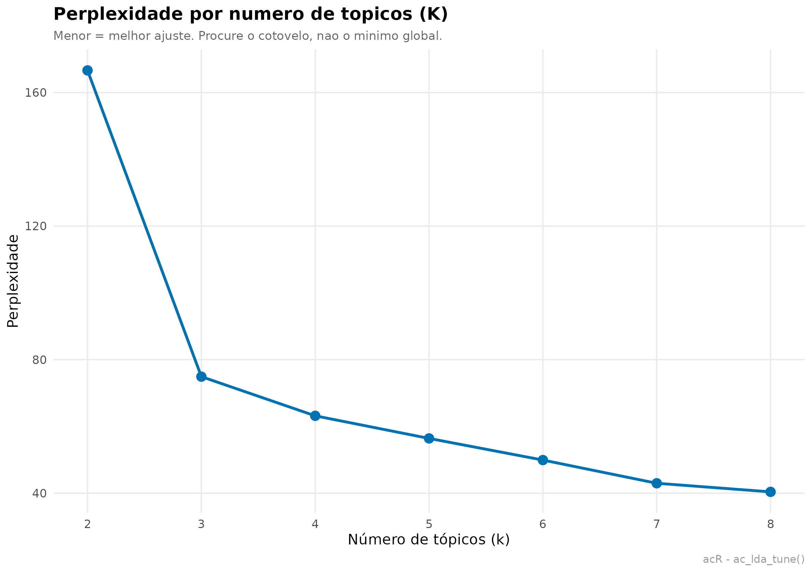
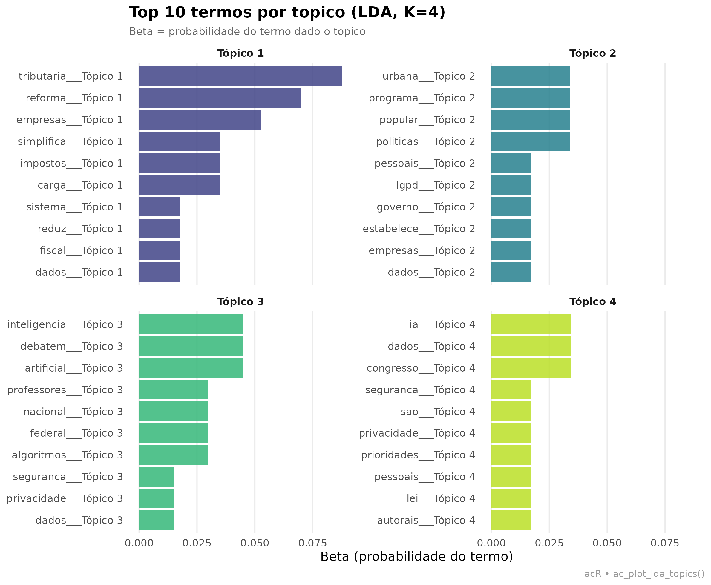
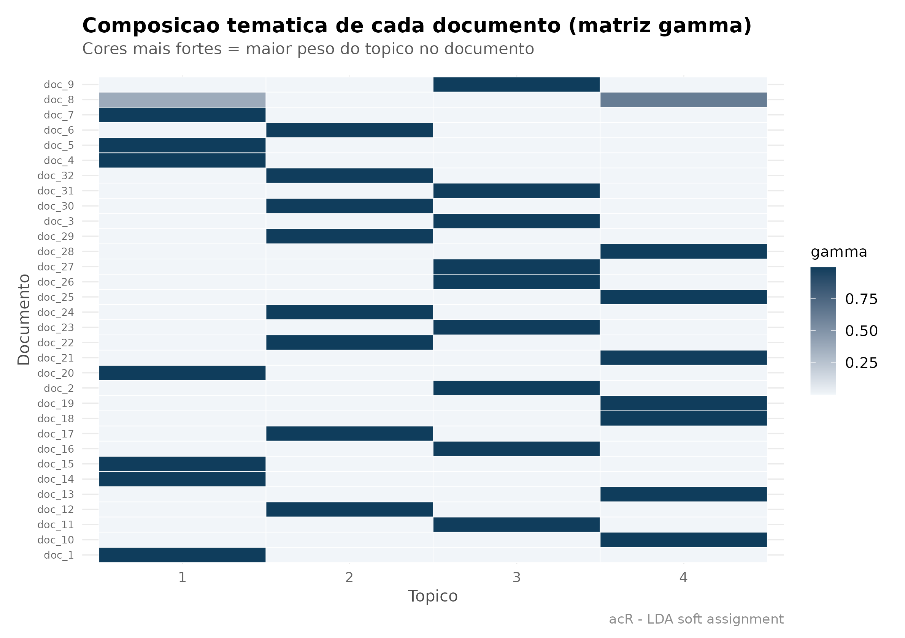

# Modelagem de topicos com LDA

## O que é LDA e para que serve

**Latent Dirichlet Allocation** (Blei, Ng & Jordan, 2003) é um modelo
probabilístico não-supervisionado que descobre *tópicos* em um corpus.
Um “tópico” é uma **distribuição de palavras**: por exemplo, um tópico
sobre saúde tende a ter alta probabilidade para “hospital”, “médico”,
“SUS”, “paciente”. Um documento é modelado como **mistura de tópicos**
com pesos diferentes.

Duas matrizes de saída são o coração do modelo:

- **beta (β)** — probabilidade de cada termo em cada tópico. Responde:
  *“que palavras definem este tópico?”*.
- **gamma (γ)** — probabilidade de cada tópico em cada documento.
  Responde: *“que temas dominam este documento?”*.

> **Quando usar LDA?** Quando você tem um corpus grande demais para ler
> tudo, quer identificar temas emergentes sem definir categorias a
> priori, e as unidades são documentos longos o suficiente para ter
> mistura temática (não frases isoladas). É comum em análise de discurso
> parlamentar, notícias, revisões de literatura, feedback de clientes.

### LDA vs. clustering vs. LLM

Três técnicas resolvem problemas parecidos e são confundidas. A
distinção importa mais que a sintaxe:

| Técnica | Saída | Você fornece |
|----|----|----|
| **LDA** (esta vignette) | Mistura probabilística de tópicos | Só o corpus + `k` |
| **Hard clustering** ([`vignette("cluster")`](https://andersonheri.github.io/acR/articles/cluster.md)) | Uma etiqueta por documento | Só o corpus + `k` |
| **LLM** ([`vignette("qualitativo-llm")`](https://andersonheri.github.io/acR/articles/qualitativo-llm.md)) | Categoria pré-definida | Codebook com categorias |

Regra prática: use **LDA** quando temas se **misturam** dentro do mesmo
texto (discurso parlamentar, notícia, artigo científico); **clustering**
quando você quer uma partição limpa para amostrar; **LLM** quando as
categorias vêm da teoria e não da distribuição empírica de palavras.

O `acR` empacota o pipeline em três chamadas:
[`ac_lda_tune()`](https://andersonheri.github.io/acR/reference/ac_lda_tune.md)
para escolher **K** (número de tópicos),
[`ac_lda()`](https://andersonheri.github.io/acR/reference/ac_lda.md)
para ajustar o modelo,
[`ac_plot_lda_topics()`](https://andersonheri.github.io/acR/reference/ac_plot_lda_topics.md)
para visualizar. Todo o restante é `dplyr` puro.

## 1. Corpus: agenda legislativa

LDA precisa de **corpus suficiente**. Aqui usamos 32 documentos cobrindo
quatro temas: reforma tributária, IA e proteção de dados, habitação, e
educação. Cada tema tem 8 documentos com vocabulário parcialmente
sobreposto (para o modelo ter algo interessante para desemaranhar).

``` r

textos <- c(
  # Tema 1: reforma tributária (8 documentos)
  "A reforma tributaria simplifica o sistema de impostos e reduz a carga fiscal para empresas.",
  "O IVA dual substitui PIS, COFINS e ICMS no novo modelo de arrecadacao federal.",
  "Deputados debatem aliquotas e excecoes tributarias para setores economicos.",
  "A reforma tributaria unifica impostos indiretos e simplifica obrigacoes das empresas.",
  "Empresarios criticam a alta carga tributaria brasileira sobre o consumo popular.",
  "O relator propoe aliquotas diferenciadas para produtos essenciais no novo IVA.",
  "A reforma tributaria promete reduzir litigios fiscais e aumentar a arrecadacao.",
  "Congresso avalia impacto da reforma tributaria sobre pequenas empresas e servicos.",
  # Tema 2: IA e proteção de dados (8 documentos)
  "O marco legal da inteligencia artificial regulamenta o uso de algoritmos e dados.",
  "Privacidade e seguranca de dados pessoais sao prioridades da nova lei de IA.",
  "Algoritmos de inteligencia artificial precisam de transparencia e auditoria publica.",
  "A LGPD estabelece regras para tratamento de dados pessoais por empresas e governo.",
  "Modelos de IA generativa levantam questoes eticas sobre direitos autorais e dados.",
  "A ANPD fiscaliza o cumprimento das regras de protecao de dados no Brasil.",
  "Especialistas defendem regulamentacao de algoritmos preditivos usados por bancos.",
  "Inteligencia artificial na saude requer protocolos de seguranca e privacidade.",
  # Tema 3: habitação e cidade (8 documentos)
  "O programa habitacional amplia recursos federais para moradia popular urbana.",
  "O deficit habitacional afeta milhoes de familias de baixa renda nas cidades.",
  "Urbanizacao de favelas e regularizacao fundiaria avancam em municipios brasileiros.",
  "Moradia digna e direito social garantido pela Constituicao federal de 1988.",
  "Assentamentos precarios crescem nas periferias metropolitanas do pais.",
  "O programa Minha Casa Minha Vida entrega novas unidades habitacionais populares.",
  "Especialistas em urbanismo debatem alugueis abusivos nas grandes cidades.",
  "Politicas de habitacao popular incluem regularizacao fundiaria e infraestrutura urbana.",
  # Tema 4: educação (8 documentos)
  "A educacao basica recebe novos recursos do Fundeb ampliado pelo Congresso.",
  "Alfabetizacao na idade certa e meta central do novo Plano Nacional de Educacao.",
  "Professores debatem remuneracao e condicoes de trabalho nas escolas publicas.",
  "O ensino medio integrado ao tecnico expande vagas em institutos federais.",
  "A avaliacao Prova Brasil mede aprendizagem em portugues e matematica.",
  "Politicas de permanencia estudantil ampliam bolsas para universitarios pobres.",
  "O piso salarial nacional dos professores e reajustado pelo governo federal.",
  "A formacao continuada de professores e desafio permanente da educacao basica."
)

corpus <- ac_corpus(
  data.frame(
    text = textos,
    tema = rep(c("tributario","tecnologia","habitacao","educacao"), each = 8L),
    stringsAsFactors = FALSE
  )
)
corpus
#> 
#> ── Corpus acR ──────────────────────────────────────────────────────────────────
#> • Documentos: 32
#> • Metadados: 1 coluna
#> • Idioma: "pt"
#> 
#> # A tibble: 32 × 3
#>   doc_id text                                                              tema 
#>   <chr>  <chr>                                                             <chr>
#> 1 doc_1  A reforma tributaria simplifica o sistema de impostos e reduz a … trib…
#> 2 doc_2  O IVA dual substitui PIS, COFINS e ICMS no novo modelo de arreca… trib…
#> 3 doc_3  Deputados debatem aliquotas e excecoes tributarias para setores … trib…
#> 4 doc_4  A reforma tributaria unifica impostos indiretos e simplifica obr… trib…
#> 5 doc_5  Empresarios criticam a alta carga tributaria brasileira sobre o … trib…
#> 6 doc_6  O relator propoe aliquotas diferenciadas para produtos essenciai… trib…
#> # ℹ 26 more rows
```

## 2. Preparar: limpeza e remoção de *stopwords*

**Sem remover *stopwords*, LDA vai identificar tópicos dominados por
“o”, “a”, “de”, “que”, “para”.** Isso mascara os padrões reais.
Removemos as *stopwords* padrão do português e adicionamos algumas
específicas do domínio legislativo (`brasil`, `pais`) que aparecem em
todos os temas.

``` r

corpus_limpo <- ac_clean(
  corpus,
  remove_stopwords = "pt",
  extra_stopwords  = c("brasil", "pais", "sobre", "novo", "nova")
)
corpus_limpo
#> 
#> ── Corpus acR ──────────────────────────────────────────────────────────────────
#> • Documentos: 32
#> • Metadados: 1 coluna
#> • Idioma: "pt"
#> 
#> # A tibble: 32 × 3
#>   doc_id text                                                              tema 
#>   <chr>  <chr>                                                             <chr>
#> 1 doc_1  reforma tributaria simplifica sistema impostos reduz carga fisca… trib…
#> 2 doc_2  iva dual substitui pis cofins icms modelo arrecadacao federal     trib…
#> 3 doc_3  deputados debatem aliquotas excecoes tributarias setores economi… trib…
#> 4 doc_4  reforma tributaria unifica impostos indiretos simplifica obrigac… trib…
#> 5 doc_5  empresarios criticam alta carga tributaria brasileira consumo po… trib…
#> 6 doc_6  relator propoe aliquotas diferenciadas produtos essenciais iva    trib…
#> # ℹ 26 more rows
```

## 3. Escolher K: quantos tópicos?

LDA exige que você especifique **K** (número de tópicos) *a priori*. A
escolha ideal é um balanço:

- **K muito baixo** → tópicos misturam temas distintos (subajuste).
- **K muito alto** → tópicos fragmentam um mesmo tema (sobreajuste,
  ruído).

A métrica clássica é **perplexidade** (menor = melhor ajuste), mas ela
tende a favorecer K altos. A regra prática (Zhao et al., 2015): procure
o “**cotovelo**” da curva — o ponto onde perplexidade para de cair
rápido e começa a estabilizar.

``` r

tune <- ac_lda_tune(
  corpus_limpo,
  k_range = 2:8,
  seed    = 42L
)
#> Testando k = 2 a 8...
tune
#> # A tibble: 7 × 2
#>       k perplexity
#>   <int>      <dbl>
#> 1     2      167. 
#> 2     3       74.9
#> 3     4       63.2
#> 4     5       56.4
#> 5     6       49.9
#> 6     7       43.0
#> 7     8       40.4
```

``` r

ac_plot_lda_tune(tune) +
  ggplot2::labs(
    title    = "Perplexidade por numero de topicos (K)",
    subtitle = "Menor = melhor ajuste. Procure o cotovelo, nao o minimo global.",
    caption  = "acR - ac_lda_tune()"
  )
```



Como este corpus foi construído com **4 temas nítidos**, esperamos que o
“cotovelo” apareça em K = 4. Em corpora reais raramente é tão limpo — o
cotovelo dá uma faixa (ex. K entre 5 e 8), e a escolha final é uma
combinação da métrica com **interpretabilidade** dos tópicos que saem.

## 4. Treinar o modelo LDA

Com K definido, ajustamos o modelo. `seed` é obrigatório para
reprodutibilidade — LDA é estocástico (Variational EM ou Gibbs
sampling), rodadas diferentes com sementes diferentes retornam **tópicos
com IDs diferentes** e pequenas variações nas distribuições.

``` r

modelo <- ac_lda(
  corpus_limpo,
  k    = 4L,
  seed = 42L
)
#> Ajustando LDA com k = 4 tópicos...
modelo
#> 
#> ── Modelo LDA acR ──────────────────────────────────────────────────────────────
#> • Tópicos (k): 4
#> • Método: "VEM"
#> • Semente: 42
#> • Termos únicos: 185
#> • Documentos: 32
```

## 5. Termos por tópico (matriz β)

Cada linha é uma combinação (tópico, termo), com `beta` = probabilidade
do termo dado o tópico. Filtramos os top termos para inspecionar o que
cada tópico “significa”.

``` r

beta <- modelo$terms
head(beta, 10)
#> # A tibble: 10 × 3
#>    topic term         beta
#>    <int> <chr>       <dbl>
#>  1     1 carga      0.0351
#>  2     1 empresas   0.0526
#>  3     1 fiscal     0.0175
#>  4     1 impostos   0.0351
#>  5     1 reduz      0.0175
#>  6     1 reforma    0.0702
#>  7     1 simplifica 0.0351
#>  8     1 sistema    0.0175
#>  9     1 tributaria 0.0877
#> 10     1 dados      0.0175
```

Visualização — os 10 termos com maior β por tópico:

``` r

ac_plot_lda_topics(modelo, top_n = 10L) +
  ggplot2::labs(
    title    = "Top 10 termos por topico (LDA, K=4)",
    subtitle = "Beta = probabilidade do termo dado o topico"
  )
```



O gráfico permite **rotular** os tópicos. Nomeamos com base nos termos
dominantes — se um tópico é dominado por *reforma*, *tributaria*, *iva*,
*aliquotas*, chamamos de “Reforma Tributária”.

## 6. Distribuição de tópicos por documento (matriz γ)

Para cada documento, quais tópicos dominam? Um documento pode ser 90%
tópico 1 (tema puro) ou distribuído entre vários tópicos (tema misto).

``` r

gamma <- modelo$documents
head(gamma, 12)
#> # A tibble: 12 × 3
#>    doc_id topic   gamma
#>    <chr>  <int>   <dbl>
#>  1 doc_1      1 0.994  
#>  2 doc_1      2 0.00186
#>  3 doc_1      3 0.00186
#>  4 doc_1      4 0.00186
#>  5 doc_10     1 0.00210
#>  6 doc_10     2 0.00210
#>  7 doc_10     3 0.00210
#>  8 doc_10     4 0.994  
#>  9 doc_11     1 0.00239
#> 10 doc_11     2 0.00239
#> 11 doc_11     3 0.993  
#> 12 doc_11     4 0.00239
```

Sumário: qual o tópico dominante de cada documento?

``` r

dominante <- gamma |>
  dplyr::group_by(doc_id) |>
  dplyr::slice_max(gamma, n = 1L, with_ties = FALSE) |>
  dplyr::ungroup() |>
  dplyr::rename(topico_dominante = topic, prob = gamma)

head(dominante, 12)
#> # A tibble: 12 × 3
#>    doc_id topico_dominante  prob
#>    <chr>             <int> <dbl>
#>  1 doc_1                 1 0.994
#>  2 doc_10                4 0.994
#>  3 doc_11                3 0.993
#>  4 doc_12                2 0.994
#>  5 doc_13                4 0.994
#>  6 doc_14                1 0.992
#>  7 doc_15                1 0.993
#>  8 doc_16                3 0.993
#>  9 doc_17                2 0.994
#> 10 doc_18                4 0.994
#> 11 doc_19                4 0.993
#> 12 doc_2                 3 0.994
```

Comparando com o **tema real** de cada documento (o `meta$tema` que
guardamos no corpus), conseguimos avaliar **quão bem o LDA recuperou a
estrutura conhecida**:

``` r

# Recuperar o metadado 'tema' e cruzar com o topico dominante
tema_real <- corpus[, c("doc_id", "tema")]
comparacao <- merge(dominante, tema_real, by = "doc_id")

# Tabela de contingencia: topico dominante x tema real
table(comparacao$topico_dominante, comparacao$tema)
#>    
#>     educacao habitacao tecnologia tributario
#>   1        0         1          2          4
#>   2        3         3          1          1
#>   3        3         1          3          2
#>   4        2         3          2          1
```

Se a diagonal for dominante (cada tópico se alinha bem com um tema
real), o modelo capturou a estrutura. Em corpora reais sem “rótulo
verdadeiro”, essa validação vem da **interpretação humana** dos tópicos
e da concordância entre codificadores.

## 7. Interpretação e nomeação dos tópicos

A prática consolidada em análise de conteúdo com LDA (DiMaggio et al.,
2013): apresente os top-N termos por tópico, proponha um **rótulo
substantivo** e valide com pelo menos um segundo pesquisador. O `acR`
facilita gerar essa tabela para incluir no artigo:

``` r

top_terms_por_topico <- beta |>
  dplyr::group_by(topic) |>
  dplyr::slice_max(beta, n = 7L, with_ties = FALSE) |>
  dplyr::summarise(
    top_termos = paste(term, collapse = ", "),
    .groups    = "drop"
  )

top_terms_por_topico
#> # A tibble: 4 × 2
#>   topic top_termos                                                              
#>   <int> <chr>                                                                   
#> 1     1 tributaria, reforma, empresas, carga, impostos, simplifica, fiscal      
#> 2     2 popular, programa, urbana, politicas, empresas, dados, pessoais         
#> 3     3 artificial, inteligencia, debatem, algoritmos, federal, nacional, profe…
#> 4     4 dados, ia, congresso, lei, pessoais, prioridades, privacidade
```

## 8. Visualizando as misturas: γ como heatmap

Uma das forças didáticas do LDA é que γ **não é** uma etiqueta — é uma
proporção. Documentos que “quase pertencem a um tema” aparecem como um
gradiente, não como uma célula preenchida. Este heatmap mostra os
documentos como linhas, os tópicos como colunas, e a cor como `gamma` (0
= nada; 1 = totalidade da massa).

``` r

gamma_ord <- gamma |>
  dplyr::mutate(doc_id = factor(doc_id, levels = sort(unique(doc_id))))

ggplot2::ggplot(
  gamma_ord,
  ggplot2::aes(x = factor(topic), y = doc_id, fill = gamma)
) +
  ggplot2::geom_tile(color = "white") +
  ggplot2::scale_fill_gradient(
    low  = "#F1F5F9",
    high = ac_palette(1),
    name = "gamma"
  ) +
  ggplot2::labs(
    title    = "Composicao tematica de cada documento (matriz gamma)",
    subtitle = "Cores mais fortes = maior peso do topico no documento",
    x        = "Topico",
    y        = "Documento",
    caption  = "acR - LDA soft assignment"
  ) +
  theme_ac() +
  ggplot2::theme(
    axis.text.y = ggplot2::element_text(size = 7)
  )
```



Compare mentalmente com o heatmap “hard clustering” da
[`vignette("cluster")`](https://andersonheri.github.io/acR/articles/cluster.md)
§4.6: lá, cada linha tem **uma** célula acesa (pertence ao grupo A
**ou** ao B). Aqui, muitas linhas têm massa espalhada entre dois ou três
tópicos. É a mesma tipologia latente, descrita em duas resoluções
diferentes — hard é uma projeção do soft.

## 9. Exportar

Salvamos as duas matrizes principais para reuso — em outros scripts, no
Excel, ou para colar em tabelas de artigo:

``` r

ac_export(beta,  arquivo = "lda_beta.csv",  formato = "csv")
ac_export(gamma, arquivo = "lda_gamma.csv", formato = "csv")

# Tabela pronta para LaTeX
ac_export(top_terms_por_topico, arquivo = "lda_topicos.tex", formato = "latex")

# Objeto R serializado (recarregavel via readRDS)
saveRDS(modelo, "lda_modelo.rds")
```

## Referências

- Blei, D. M.; Ng, A. Y.; Jordan, M. I. (2003). Latent Dirichlet
  Allocation. *Journal of Machine Learning Research*, 3, 993-1022.
- DiMaggio, P.; Nag, M.; Blei, D. (2013). Exploiting affinities between
  topic modeling and the sociological perspective on culture:
  Application to newspaper coverage of U.S. government arts funding.
  *Poetics*, 41(6), 570-606.
- Zhao, W. et al. (2015). A heuristic approach to determine an
  appropriate number of topics in topic modeling. *BMC Bioinformatics*,
  16(S13).
- Silge, J.; Robinson, D. (2017). *Text Mining with R*. O’Reilly.
