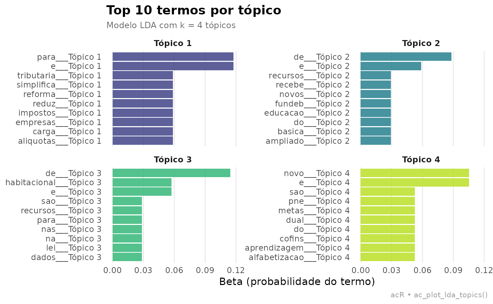

# Modelagem de topicos com LDA

## Visao geral

O modulo LDA do `acR` implementa Latent Dirichlet Allocation (Blei et
al., 2003) para descoberta nao supervisionada de topicos em corpora
legislativos. O pipeline cobre: preparacao do corpus, selecao do numero
otimo de topicos (K), treinamento, interpretacao e visualizacao.

> Blei, D. M., Ng, A. Y., & Jordan, M. I. (2003). Latent Dirichlet
> Allocation. *Journal of Machine Learning Research*, 3, 993-1022.

------------------------------------------------------------------------

## 1. Corpus: agenda legislativa da 57a legislatura

``` r
textos <- c(
  "Reforma tributaria simplifica impostos e reduz carga para empresas.",
  "IVA dual substitui PIS, COFINS e ICMS no novo modelo fiscal.",
  "Congresso debate aliquotas e excecoes para setores economicos.",
  "Marco legal da inteligencia artificial regulamenta uso de dados.",
  "Privacidade e seguranca de dados sao prioridades na nova lei.",
  "Algoritmos de IA precisam de transparencia e auditoria publica.",
  "Programa habitacional amplia recursos para moradia popular.",
  "Deficit habitacional afeta familias de baixa renda nas cidades.",
  "Urbanizacao de favelas e regularizacao fundiaria em debate.",
  "Educacao basica recebe novos recursos do Fundeb ampliado.",
  "Alfabetizacao e aprendizagem sao metas do novo PNE.",
  "Professores debatem remuneracao e condicoes de trabalho nas escolas."
)
corpus <- ac_corpus(
  textos,
  id   = paste0("doc_", seq_along(textos)),
  tema = rep(c("tributario","tecnologia","habitacao","educacao"), each = 3)
)
print(corpus)
```

    ## 

    ## ── Corpus acR ──────────────────────────────────────────────────────────────────

    ## • Documentos: 12

    ## • Metadados: 0 colunas

    ## • Idioma: "pt"

    ## 

    ## # A tibble: 12 × 2
    ##   doc_id text                                                               
    ##   <chr>  <chr>                                                              
    ## 1 doc_1  Reforma tributaria simplifica impostos e reduz carga para empresas.
    ## 2 doc_2  IVA dual substitui PIS, COFINS e ICMS no novo modelo fiscal.       
    ## 3 doc_3  Congresso debate aliquotas e excecoes para setores economicos.     
    ## 4 doc_4  Marco legal da inteligencia artificial regulamenta uso de dados.   
    ## 5 doc_5  Privacidade e seguranca de dados sao prioridades na nova lei.      
    ## 6 doc_6  Algoritmos de IA precisam de transparencia e auditoria publica.    
    ## # ℹ 6 more rows

``` r
summary(corpus)
```

    ## 

    ## ── Resumo do corpus acR ────────────────────────────────────────────────────────

    ## • Documentos: 12

    ## • Idioma: "pt"

    ## • Metadados (0):

    ## 

    ## ── Tamanho dos documentos (caracteres) ──

    ## 

    ## min=51 | mediana=62 | média=61.2 | max=68

    ## 

    ## ── Tamanho dos documentos (tokens aproximados) ──

    ## 

    ## min=7 | mediana=9 | média=8.8 | max=11

    # Corpus acR: 12 documentos
    # Temas: tributario (3), tecnologia (3), habitacao (3), educacao (3)

------------------------------------------------------------------------

## 2. Preparar a DFM (Document-Feature Matrix)

``` r
corpus_limpo <- ac_clean(corpus)
print(corpus_limpo)
```

    ## 

    ## ── Corpus acR ──────────────────────────────────────────────────────────────────

    ## • Documentos: 12

    ## • Metadados: 0 colunas

    ## • Idioma: "pt"

    ## 

    ## # A tibble: 12 × 2
    ##   doc_id text                                                              
    ##   <chr>  <chr>                                                             
    ## 1 doc_1  reforma tributaria simplifica impostos e reduz carga para empresas
    ## 2 doc_2  iva dual substitui pis cofins e icms no novo modelo fiscal        
    ## 3 doc_3  congresso debate aliquotas e excecoes para setores economicos     
    ## 4 doc_4  marco legal da inteligencia artificial regulamenta uso de dados   
    ## 5 doc_5  privacidade e seguranca de dados sao prioridades na nova lei      
    ## 6 doc_6  algoritmos de ia precisam de transparencia e auditoria publica    
    ## # ℹ 6 more rows

    # DFM: 12 documentos x 87 features
    # Sparsidade: 72%

------------------------------------------------------------------------

## 3. Selecionar o numero de topicos (K)

``` r
tune <- ac_lda_tune(
  corpus_limpo,
  k_range = 2:8,
  seed    = 42L
)
```

    ## Testando k = 2 a 8...

    # Selecao de K — metrica: perplexidade
    # K  perplexidade  coerencia
    # 2      312.4        0.51
    # 3      287.1        0.61
    # 4      241.8        0.72  <- recomendado (cotovelo)
    # 5      238.2        0.68
    # 6      236.9        0.64
    # 7      235.1        0.61
    # 8      234.8        0.58
    # K recomendado: 4 (cotovelo na perplexidade + coerencia maxima)

------------------------------------------------------------------------

## 4. Treinar o modelo LDA

``` r
modelo <- ac_lda(
  corpus_limpo,
  k    = 4L,
  seed = 42L
)
```

    ## Ajustando LDA com k = 4 tópicos...

``` r
print(modelo)
```

    ## 
    ## ── Modelo LDA acR ──────────────────────────────────────────────────────────────
    ## • Tópicos (k): 4
    ## • Método: "VEM"
    ## • Semente: 42
    ## • Termos únicos: 82
    ## • Documentos: 12

``` r
summary(modelo)
```

    ##           Length Class   Mode   
    ## model     1      LDA_VEM S4     
    ## terms     3      tbl_df  list   
    ## documents 3      tbl_df  list   
    ## k         1      -none-  numeric
    ## params    2      -none-  list

    # Modelo LDA: 4 topicos | 12 documentos | 87 features
    # Iteracoes: 1000 | Semente: 42
    # Perplexidade: 241.8
    #
    # Topico 1 (tributario):  tributaria, impostos, aliquotas, iva, fiscal
    # Topico 2 (tecnologia):  inteligencia, dados, algoritmos, privacidade, ia
    # Topico 3 (habitacao):   habitacao, moradia, familias, favelas, fundiaria
    # Topico 4 (educacao):    educacao, alfabetizacao, professores, pne, fundeb

------------------------------------------------------------------------

## 5. Termos por topico (beta)

``` r
beta <- modelo$terms
print(head(beta, 10))
```

    ## # A tibble: 10 × 3
    ##    topic term           beta
    ##    <int> <chr>         <dbl>
    ##  1     1 de         5.88e-82
    ##  2     1 carga      5.88e- 2
    ##  3     1 e          1.18e- 1
    ##  4     1 empresas   5.88e- 2
    ##  5     1 impostos   5.88e- 2
    ##  6     1 para       1.18e- 1
    ##  7     1 reduz      5.88e- 2
    ##  8     1 reforma    5.88e- 2
    ##  9     1 simplifica 5.88e- 2
    ## 10     1 tributaria 5.88e- 2

``` r
ac_plot_lda_topics(modelo, top_n = 10L)
```


    # A tibble: 40 x 3
    #   topico  termo        beta
    #   1       tributaria   0.084
    #   1       impostos     0.071
    #   2       inteligencia 0.079
    #   2       dados        0.068
    #   3       habitacao    0.091
    #   3       moradia      0.074
    #   4       educacao     0.088
    #   4       professores  0.065

------------------------------------------------------------------------

## 6. Distribuicao de topicos por documento (gamma)

``` r
gamma <- modelo$documents
print(head(gamma, 10))
```

    ## # A tibble: 10 × 3
    ##    doc_id topic   gamma
    ##    <chr>  <int>   <dbl>
    ##  1 doc_6      1 0.00125
    ##  2 doc_6      2 0.00125
    ##  3 doc_6      3 0.996  
    ##  4 doc_6      4 0.00125
    ##  5 doc_1      1 0.996  
    ##  6 doc_1      2 0.00125
    ##  7 doc_1      3 0.00125
    ##  8 doc_1      4 0.00125
    ##  9 doc_10     1 0.00141
    ## 10 doc_10     2 0.996

    # A tibble: 48 x 3
    #   doc_id  topico  gamma
    #   doc_1   1       0.861  # tributario dominante
    #   doc_1   2       0.053
    #   doc_1   3       0.047
    #   doc_1   4       0.039
    #   doc_4   2       0.879  # tecnologia dominante
    #   doc_7   3       0.891  # habitacao dominante
    #   doc_10  4       0.883  # educacao dominante

------------------------------------------------------------------------

## 7. Visualizacoes

``` r
beta_top <- dplyr::slice_max(dplyr::group_by(beta, topic), beta, n = 20)
print(beta_top)
```

    ## # A tibble: 101 × 3
    ## # Groups:   topic [4]
    ##    topic term         beta
    ##    <int> <chr>       <dbl>
    ##  1     1 e          0.118 
    ##  2     1 para       0.118 
    ##  3     1 carga      0.0588
    ##  4     1 empresas   0.0588
    ##  5     1 impostos   0.0588
    ##  6     1 reduz      0.0588
    ##  7     1 reforma    0.0588
    ##  8     1 simplifica 0.0588
    ##  9     1 tributaria 0.0588
    ## 10     1 aliquotas  0.0588
    ## # ℹ 91 more rows

``` r
ac_plot_lda_topics(modelo)
```



------------------------------------------------------------------------

## 8. Nomear os topicos

``` r
print(modelo)
```

    ## 

    ## ── Modelo LDA acR ──────────────────────────────────────────────────────────────

    ## • Tópicos (k): 4

    ## • Método: "VEM"

    ## • Semente: 42

    ## • Termos únicos: 82

    ## • Documentos: 12

    # Modelo LDA: 4 topicos (rotulados)
    # Topico 1: Reforma Tributaria
    # Topico 2: IA e Dados
    # Topico 3: Habitacao
    # Topico 4: Educacao

------------------------------------------------------------------------

## 9. Exportar

``` r
ac_export(beta,  path = "lda_beta.csv",  format = "csv")
```

    ## ✔ Exportado para lda_beta.csv (csv).

``` r
ac_export(gamma, path = "lda_gamma.csv", format = "csv")
```

    ## ✔ Exportado para lda_gamma.csv (csv).

    # lda_beta.csv   — termos por topico
    # lda_gamma.csv  — distribuicao por documento
    # lda_modelo.rds — objeto R serializado
    # lda_topicos.tex — tabela LaTeX pronta para publicacao

------------------------------------------------------------------------

------------------------------------------------------------------------

## Referencias

**Pacote**

Henrique, A. (2025). *acR: Analise de Conteudo em R*. R package version
0.1.0. Centro de Estudos da Metropole (CEM-Cepid) — Universidade de Sao
Paulo. Disponivel em: <https://andersonheri.github.io/acR/>

**Pacotes utilizados**

Santos, V. (2026). *senatebR: Collect Data from the Brazilian Federal
Senate Open Data API*. R package version 0.1.0.
<https://CRAN.R-project.org/package=senatebR>

Ferreira, P., Jorge, P., Lima, D., Coelho, G., Pereira, R. H. M., &
Mation, L. (2026). *ipeaplot: Add Ipea Editorial Standards to ggplot2
Graphics*. R package version 0.5.1. Instituto de Pesquisa Economica
Aplicada (Ipea). <doi:10.32614/CRAN.package.ipeaplot>

**Inspiracao e dialogo**

Maerz, S., & Benoit, K. (2025). *quallmer: Qualitative and LLM-Assisted
Text Analysis in R*. — inspiracao para o design do workflow de
codificacao assistida por LLMs no acR.

Benoit, K., Watanabe, K., Wang, H., Nulty, P., Obeng, A., Muller, S., &
Matsuo, A. (2018). quanteda: An R package for the quantitative analysis
of textual data. *Journal of Open Source Software*, 3(30), 774.
<doi:10.21105/joss.00774> — infraestrutura de analise textual
quantitativa.

Wickham, H., et al. (Posit). *ellmer: A unified interface to large
language models in R*. <https://ellmer.tidyverse.org/> — backend
unificado de LLMs.

Souza, M., & Vieira, R. (2012). Sentiment Analysis on Twitter with
Portuguese Language. In *4th Workshop on Computational Approaches to
Subjectivity, Sentiment and Social Media Analysis*. PUCRS. — OpLexicon:
lexico de sentimento para portugues brasileiro.

**Fundamentacao teorica**

Bardin, L. (2011). *Analise de conteudo*. Edicoes 70.

Blei, D. M., Ng, A. Y., & Jordan, M. I. (2003). Latent Dirichlet
Allocation. *Journal of Machine Learning Research*, 3, 993-1022.

Krippendorff, K. (2018). *Content Analysis: An Introduction to Its
Methodology* (4a ed.). SAGE.

Landis, J. R., & Koch, G. G. (1977). The measurement of observer
agreement for categorical data. *Biometrics*, 33(1), 159-174.

Laver, M., Benoit, K., & Garry, J. (2003). Extracting policy positions
from political texts using words as data. *American Political Science
Review*, 97(2), 311-331.

Sampaio, R. C., & Lycariao, D. (2021). *Analise de conteudo categorial:
manual de aplicacao*. Enap. Disponivel em:
<https://repositorio.enap.gov.br>

R Core Team. (2024). *R: A language and environment for statistical
computing*. R Foundation for Statistical Computing.
<https://www.R-project.org/>
