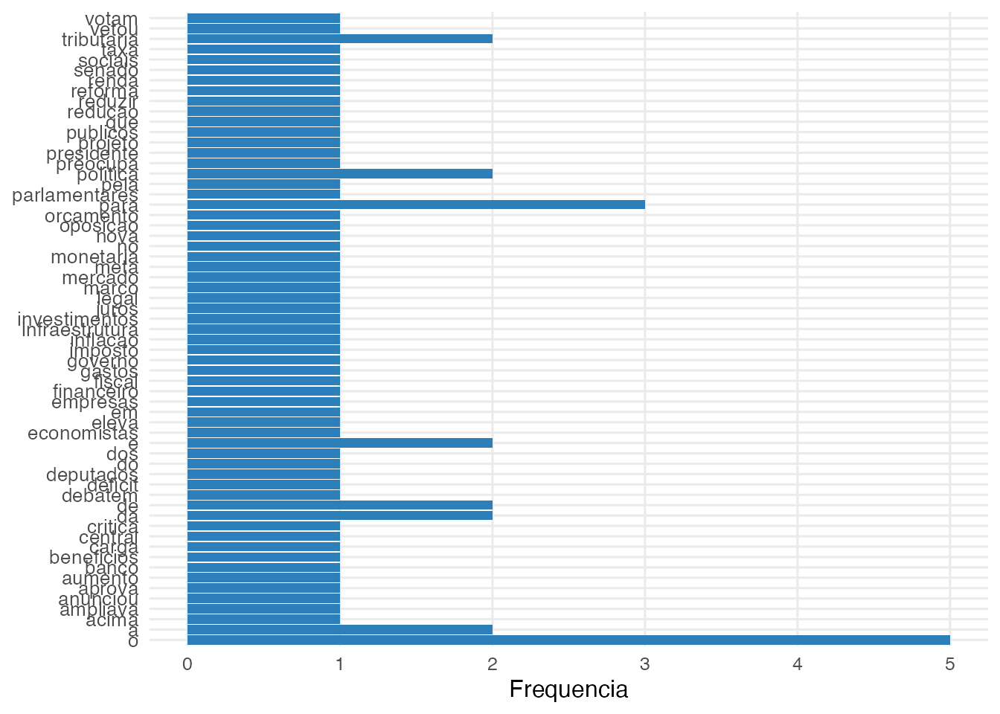
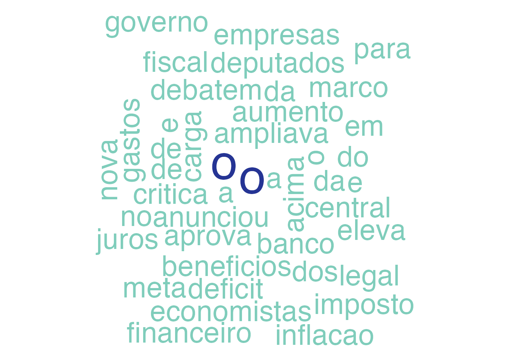
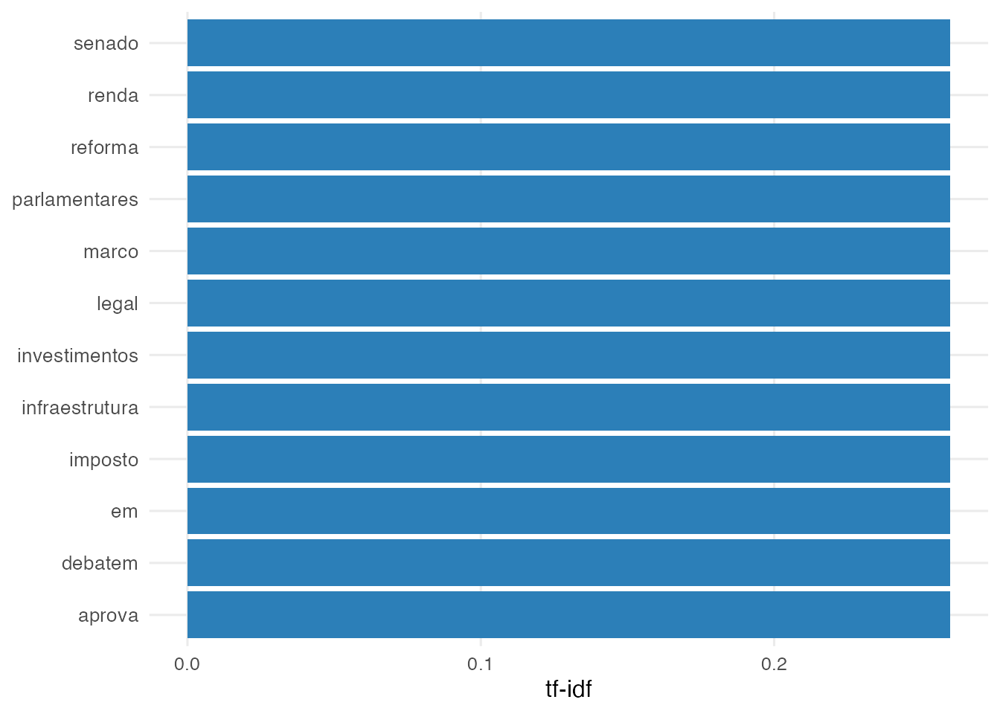
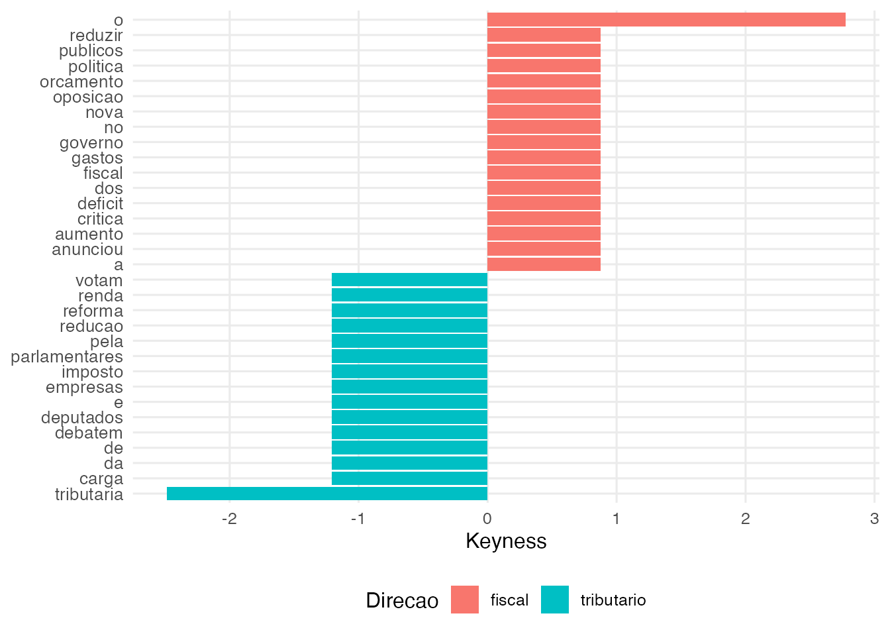
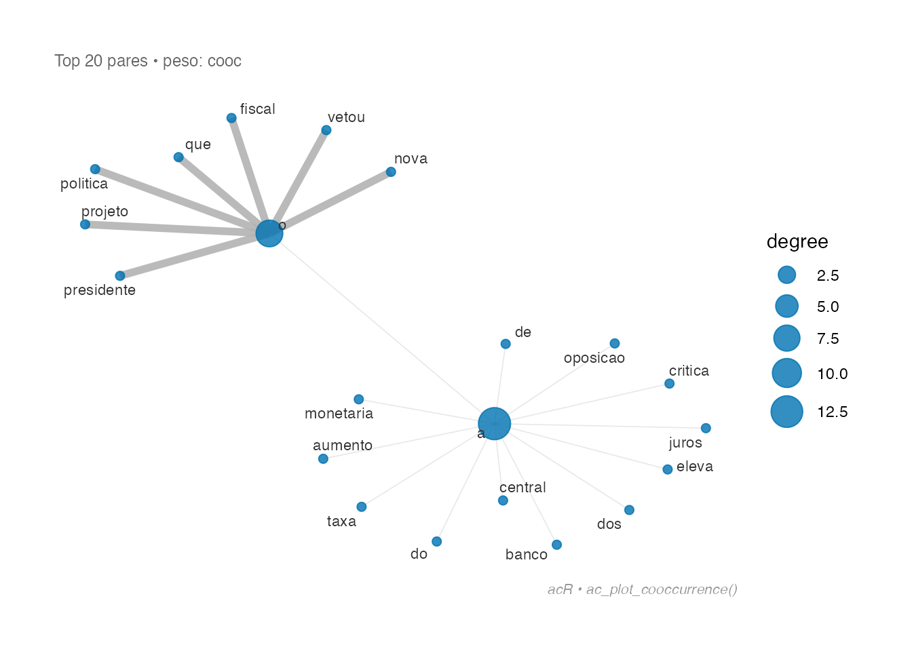

# Analise quantitativa de texto

## 1. Corpus

``` r
library(acR)
textos <- c(
  "O governo anunciou nova politica fiscal para reduzir o deficit.",
  "A oposicao critica o aumento dos gastos publicos no orcamento.",
  "Parlamentares debatem reforma tributaria e imposto de renda.",
  "O presidente vetou o projeto que ampliava beneficios sociais.",
  "Senado aprova marco legal para investimentos em infraestrutura.",
  "Deputados votam pela reducao da carga tributaria para empresas.",
  "Politica monetaria do Banco Central eleva a taxa de juros.",
  "Inflacao acima da meta preocupa economistas e mercado financeiro."
)
corpus <- ac_corpus(data.frame(
  text = textos,
  tema = c("fiscal","fiscal","tributario","social","infraestrutura","tributario","monetario","monetario"),
  stringsAsFactors = FALSE
))
print(corpus)
#> 
#> ── Corpus acR ──────────────────────────────────────────────────────────────────
#> • Documentos: 8
#> • Metadados: 1 coluna
#> • Idioma: "pt"
#> 
#> # A tibble: 8 × 3
#>   doc_id text                                                            tema   
#>   <chr>  <chr>                                                           <chr>  
#> 1 doc_1  O governo anunciou nova politica fiscal para reduzir o deficit. fiscal 
#> 2 doc_2  A oposicao critica o aumento dos gastos publicos no orcamento.  fiscal 
#> 3 doc_3  Parlamentares debatem reforma tributaria e imposto de renda.    tribut…
#> 4 doc_4  O presidente vetou o projeto que ampliava beneficios sociais.   social 
#> 5 doc_5  Senado aprova marco legal para investimentos em infraestrutura. infrae…
#> 6 doc_6  Deputados votam pela reducao da carga tributaria para empresas. tribut…
#> # ℹ 2 more rows
```

## 2. Limpeza

``` r
corpus_limpo <- ac_clean(corpus)
print(corpus_limpo)
#> 
#> ── Corpus acR ──────────────────────────────────────────────────────────────────
#> • Documentos: 8
#> • Metadados: 1 coluna
#> • Idioma: "pt"
#> 
#> # A tibble: 8 × 3
#>   doc_id text                                                           tema    
#>   <chr>  <chr>                                                          <chr>   
#> 1 doc_1  o governo anunciou nova politica fiscal para reduzir o deficit fiscal  
#> 2 doc_2  a oposicao critica o aumento dos gastos publicos no orcamento  fiscal  
#> 3 doc_3  parlamentares debatem reforma tributaria e imposto de renda    tributa…
#> 4 doc_4  o presidente vetou o projeto que ampliava beneficios sociais   social  
#> 5 doc_5  senado aprova marco legal para investimentos em infraestrutura infraes…
#> 6 doc_6  deputados votam pela reducao da carga tributaria para empresas tributa…
#> # ℹ 2 more rows
```

## 3. Tokenizacao

``` r
tokens <- ac_tokenize(corpus_limpo, n = 1L)
print(head(tokens, 20))
#> # A tibble: 20 × 3
#>    doc_id token_id token    
#>    <chr>     <int> <chr>    
#>  1 doc_1         1 o        
#>  2 doc_1         2 governo  
#>  3 doc_1         3 anunciou 
#>  4 doc_1         4 nova     
#>  5 doc_1         5 politica 
#>  6 doc_1         6 fiscal   
#>  7 doc_1         7 para     
#>  8 doc_1         8 reduzir  
#>  9 doc_1         9 o        
#> 10 doc_1        10 deficit  
#> 11 doc_2         1 a        
#> 12 doc_2         2 oposicao 
#> 13 doc_2         3 critica  
#> 14 doc_2         4 o        
#> 15 doc_2         5 aumento  
#> 16 doc_2         6 dos      
#> 17 doc_2         7 gastos   
#> 18 doc_2         8 publicos 
#> 19 doc_2         9 no       
#> 20 doc_2        10 orcamento
```

## 4. Frequencia

``` r
contagem <- ac_count(corpus_limpo)
print(contagem)
#> # A tibble: 71 × 3
#>    doc_id token        n
#>    <chr>  <chr>    <int>
#>  1 doc_1  o            2
#>  2 doc_4  o            2
#>  3 doc_1  anunciou     1
#>  4 doc_1  deficit      1
#>  5 doc_1  fiscal       1
#>  6 doc_1  governo      1
#>  7 doc_1  nova         1
#>  8 doc_1  para         1
#>  9 doc_1  politica     1
#> 10 doc_1  reduzir      1
#> # ℹ 61 more rows
```

## 5. Top termos

``` r
top <- ac_top_terms(contagem, n = 15)
ac_plot_top_terms(top)
```



## 6. Nuvem de palavras

``` r
ac_wordcloud(contagem, max_words = 50)
#> Warning in wordcloud::wordcloud(words = df_plot$token, freq = df_plot$n, :
#> infraestrutura could not be fit on page. It will not be plotted.
#> Warning in wordcloud::wordcloud(words = df_plot$token, freq = df_plot$n, :
#> investimentos could not be fit on page. It will not be plotted.
#> Warning in wordcloud::wordcloud(words = df_plot$token, freq = df_plot$n, :
#> mercado could not be fit on page. It will not be plotted.
#> Warning in wordcloud::wordcloud(words = df_plot$token, freq = df_plot$n, :
#> monetaria could not be fit on page. It will not be plotted.
#> Warning in wordcloud::wordcloud(words = df_plot$token, freq = df_plot$n, :
#> oposicao could not be fit on page. It will not be plotted.
#> Warning in wordcloud::wordcloud(words = df_plot$token, freq = df_plot$n, :
#> orcamento could not be fit on page. It will not be plotted.
```



    #> Warning in wordcloud::wordcloud(words = df_plot$token, freq = df_plot$n, : para
    #> could not be fit on page. It will not be plotted.

## 7. TF-IDF

``` r
tfidf <- ac_tf_idf(contagem)
ac_plot_tf_idf(tfidf, n = 10)
```



## 8. Keyness

``` r
freq_tema <- ac_count(corpus_limpo, by = "tema")
freq_2grupos <- freq_tema[freq_tema$tema %in% c("fiscal", "tributario"), ]
kn <- ac_keyness(freq_2grupos, group = "tema", target = "fiscal")
ac_plot_keyness(kn, n = 15)
```



## 9. Coocorrencia

``` r
cooc <- ac_cooccurrence(corpus_limpo, window = 5L)
ac_plot_cooccurrence(cooc, top_n = 20)
```


