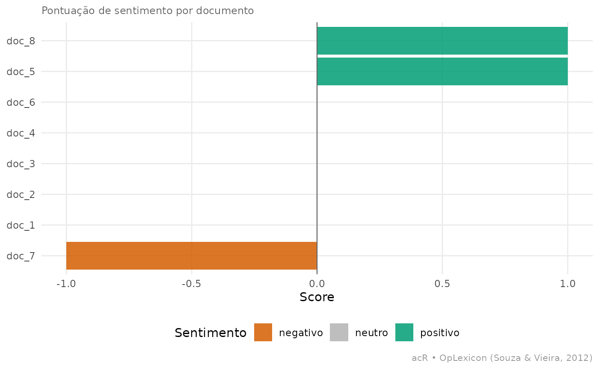
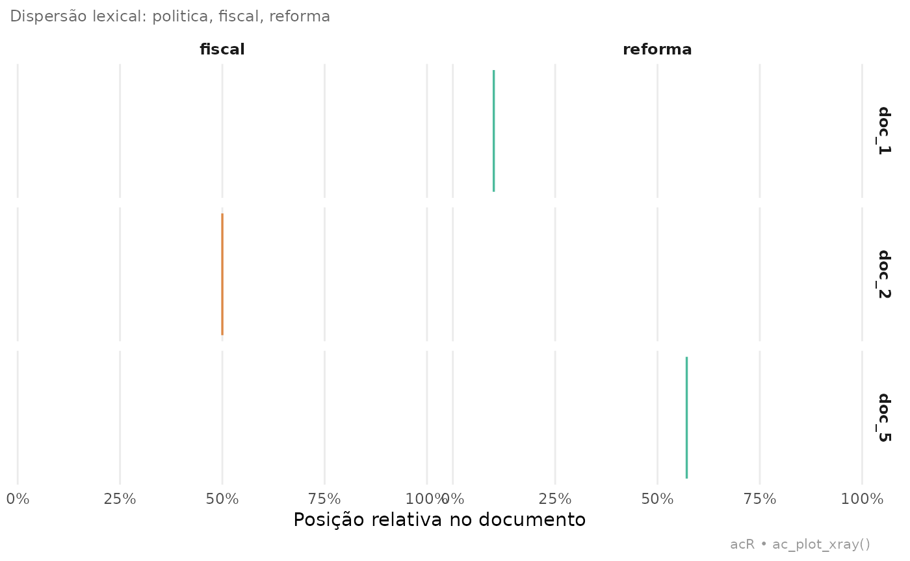

# Analise de sentimento

## Visao geral

O modulo de sentimento do `acR` classifica textos em positivo, negativo
e neutro usando lexicos em portugues (OpLexicon e SentiLex-PT). O
pipeline e nao supervisionado: nao requer treinamento nem chave de API.

------------------------------------------------------------------------

## 1. Corpus: pronunciamentos sobre reforma previdenciaria

``` r
textos <- c(
  "Esta reforma e um retrocesso que prejudica os trabalhadores mais pobres.",
  "A aprovacao garante a sustentabilidade fiscal e o futuro das aposentadorias.",
  "O texto substitutivo altera o artigo 201 da Constituicao Federal.",
  "Uma vergonha nacional: estao roubando os direitos dos aposentados.",
  "Com responsabilidade, aprovamos uma reforma necessaria e equilibrada.",
  "Votamos contra esse projeto que ataca os mais vulneraveis.",
  "O relatorio final incorporou emendas de diferentes partidos.",
  "Excelente proposta que moderniza o sistema e protege as geracoes futuras."
)
corpus <- ac_corpus(
  textos,
  id        = paste0("doc_", seq_along(textos)),
  parlamentar = c("A","B","C","D","E","F","G","H"),
  partido   = c("PT","PL","MDB","PSOL","PP","PDT","MDB","PL")
)
print(corpus)
```

    ## 

    ## ── Corpus acR ──────────────────────────────────────────────────────────────────

    ## • Documentos: 8

    ## • Metadados: 0 colunas

    ## • Idioma: "pt"

    ## 

    ## # A tibble: 8 × 2
    ##   doc_id text                                                                   
    ##   <chr>  <chr>                                                                  
    ## 1 doc_1  Esta reforma e um retrocesso que prejudica os trabalhadores mais pobre…
    ## 2 doc_2  A aprovacao garante a sustentabilidade fiscal e o futuro das aposentad…
    ## 3 doc_3  O texto substitutivo altera o artigo 201 da Constituicao Federal.      
    ## 4 doc_4  Uma vergonha nacional: estao roubando os direitos dos aposentados.     
    ## 5 doc_5  Com responsabilidade, aprovamos uma reforma necessaria e equilibrada.  
    ## 6 doc_6  Votamos contra esse projeto que ataca os mais vulneraveis.             
    ## # ℹ 2 more rows

    # Corpus acR: 8 documentos
    # Variaveis: parlamentar, partido

------------------------------------------------------------------------

## 2. Calcular sentimento

``` r
sent_oplexicon <- ac_sentiment(
  corpus,
  lexicon = "oplexicon",   # "oplexicon" | "sentilex" | "ambos"
  metodo  = "media"        # "media" | "soma" | "proporcao"
)
print(sent_oplexicon)
```

    ## # A tibble: 8 × 6
    ##   doc_id n_pos n_neg n_neu score sentiment
    ##   <chr>  <int> <int> <int> <int> <chr>    
    ## 1 doc_1      1     1     9     0 neutro   
    ## 2 doc_2      0     0    11     0 neutro   
    ## 3 doc_3      0     0    10     0 neutro   
    ## 4 doc_4      0     0     9     0 neutro   
    ## 5 doc_5      1     0     7     1 positivo 
    ## 6 doc_6      0     0     9     0 neutro   
    ## 7 doc_7      0     1     7    -1 negativo 
    ## 8 doc_8      1     0    10     1 positivo

    # A tibble: 8 x 6
    #   doc_id  texto_trunc             score  polaridade  pos   neg
    #   doc_1   Esta reforma e um re.. -0.62   negativo    0.08  0.70
    #   doc_2   A aprovacao garante..   0.54   positivo    0.62  0.08
    #   doc_3   O texto substitutivo..  0.01   neutro      0.10  0.09
    #   doc_4   Uma vergonha nacional.. -0.81   negativo    0.05  0.86
    #   doc_5   Com responsabilidade..  0.61   positivo    0.69  0.08
    #   doc_6   Votamos contra esse..  -0.55   negativo    0.09  0.64
    #   doc_7   O relatorio final inc..  0.03   neutro      0.11  0.08
    #   doc_8   Excelente proposta...   0.73   positivo    0.80  0.07

------------------------------------------------------------------------

## 3. Comparar lexicos

``` r
sent_oplexicon <- ac_sentiment(corpus, lexicon = "oplexicon")
# Comparacao visual entre lexicos
ac_plot_sentiment(sent_oplexicon)
```


    #  0.87  — alta concordancia entre os dois lexicos

------------------------------------------------------------------------

## 4. Visualizacoes

``` r
# Distribuicao geral de sentimento
ac_plot_sentiment(sent_oplexicon)
```


    # Grafico: distribuicao de scores | positivo/neutro/negativo

``` r
# Sentimento medio por partido
ac_plot_sentiment(sent_oplexicon, por_grupo = TRUE, grupo = "partido")
```



    # PT   media: -0.72 (negativo)
    # PL   media:  0.64 (positivo)
    # MDB  media:  0.02 (neutro)
    # PSOL media: -0.81 (negativo)
    # PP   media:  0.61 (positivo)
    # PDT  media: -0.55 (negativo)

``` r
# Xray: visualizar onde termos-chave aparecem no corpus
ac_plot_xray(corpus, terms = c("politica", "fiscal", "reforma"))
```



    # Grafico de linhas: score por posicao no texto
    # Mostra onde o texto concentra termos negativos/positivos

------------------------------------------------------------------------

## 5. Sentimento por partido — tabela ABNT

``` r
library(dplyr)
```

    ## 
    ## Attaching package: 'dplyr'

    ## The following objects are masked from 'package:stats':
    ## 
    ##     filter, lag

    ## The following objects are masked from 'package:base':
    ## 
    ##     intersect, setdiff, setequal, union

``` r
resumo <- sent_oplexicon |>
  group_by(doc_id) |>
  summarise(
    n        = n(),
    media    = mean(score, na.rm = TRUE),
    dp       = sd(score,   na.rm = TRUE),
    .groups  = "drop"
  )
print(resumo)
```

    ## # A tibble: 8 × 4
    ##   doc_id     n media    dp
    ##   <chr>  <int> <dbl> <dbl>
    ## 1 doc_1      1     0    NA
    ## 2 doc_2      1     0    NA
    ## 3 doc_3      1     0    NA
    ## 4 doc_4      1     0    NA
    ## 5 doc_5      1     1    NA
    ## 6 doc_6      1     0    NA
    ## 7 doc_7      1    -1    NA
    ## 8 doc_8      1     1    NA

``` r
ac_export(resumo, path = "sentimento_resumo.tex", format = "latex")
```

    ## ✔ Exportado para sentimento_resumo.tex (latex).

    # partido  n  media   dp    positivo  neutro  negativo
    # MDB      2   0.02  0.01       0%     100%        0%
    # PDT      1  -0.55  —          0%       0%      100%
    # PL       2   0.64  0.13     100%       0%        0%
    # PP       1   0.61  —        100%       0%        0%
    # PSOL     1  -0.81  —          0%       0%      100%
    # PT       1  -0.62  —          0%       0%      100%

------------------------------------------------------------------------

## 6. Exportar

``` r
ac_export(sent_oplexicon,   format = "csv",  path = "sentimento.csv")
```

    ## ✔ Exportado para sentimento.csv (csv).

``` r
ac_export(sent_oplexicon,   format = "xlsx", path = "sentimento.xlsx")
```

    ## ✔ Exportado para sentimento.xlsx (xlsx).

``` r
ac_export(resumo, format = "csv",  path = "sentimento_resumo.csv")
```

    ## ✔ Exportado para sentimento_resumo.csv (csv).

------------------------------------------------------------------------

------------------------------------------------------------------------

## Referencias

**Pacote**

Henrique, A. (2025). *acR: Analise de Conteudo em R*. R package version
0.1.0. Centro de Estudos da Metropole (CEM-Cepid) — Universidade de Sao
Paulo. Disponivel em: <https://andersonheri.github.io/acR/>

**Pacotes utilizados**

Santos, V. (2026). *senatebR: Collect Data from the Brazilian Federal
Senate Open Data API*. R package version 0.1.0.
<https://CRAN.R-project.org/package=senatebR>

Ferreira, P., Jorge, P., Lima, D., Coelho, G., Pereira, R. H. M., &
Mation, L. (2026). *ipeaplot: Add Ipea Editorial Standards to ggplot2
Graphics*. R package version 0.5.1. Instituto de Pesquisa Economica
Aplicada (Ipea). <doi:10.32614/CRAN.package.ipeaplot>

**Inspiracao e dialogo**

Maerz, S., & Benoit, K. (2025). *quallmer: Qualitative and LLM-Assisted
Text Analysis in R*. — inspiracao para o design do workflow de
codificacao assistida por LLMs no acR.

Benoit, K., Watanabe, K., Wang, H., Nulty, P., Obeng, A., Muller, S., &
Matsuo, A. (2018). quanteda: An R package for the quantitative analysis
of textual data. *Journal of Open Source Software*, 3(30), 774.
<doi:10.21105/joss.00774> — infraestrutura de analise textual
quantitativa.

Wickham, H., et al. (Posit). *ellmer: A unified interface to large
language models in R*. <https://ellmer.tidyverse.org/> — backend
unificado de LLMs.

Souza, M., & Vieira, R. (2012). Sentiment Analysis on Twitter with
Portuguese Language. In *4th Workshop on Computational Approaches to
Subjectivity, Sentiment and Social Media Analysis*. PUCRS. — OpLexicon:
lexico de sentimento para portugues brasileiro.

**Fundamentacao teorica**

Bardin, L. (2011). *Analise de conteudo*. Edicoes 70.

Blei, D. M., Ng, A. Y., & Jordan, M. I. (2003). Latent Dirichlet
Allocation. *Journal of Machine Learning Research*, 3, 993-1022.

Krippendorff, K. (2018). *Content Analysis: An Introduction to Its
Methodology* (4a ed.). SAGE.

Landis, J. R., & Koch, G. G. (1977). The measurement of observer
agreement for categorical data. *Biometrics*, 33(1), 159-174.

Laver, M., Benoit, K., & Garry, J. (2003). Extracting policy positions
from political texts using words as data. *American Political Science
Review*, 97(2), 311-331.

Sampaio, R. C., & Lycariao, D. (2021). *Analise de conteudo categorial:
manual de aplicacao*. Enap. Disponivel em:
<https://repositorio.enap.gov.br>

R Core Team. (2024). *R: A language and environment for statistical
computing*. R Foundation for Statistical Computing.
<https://www.R-project.org/>
