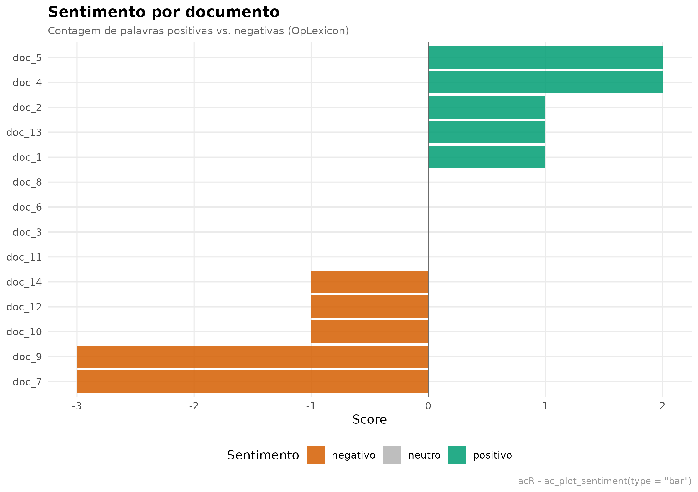
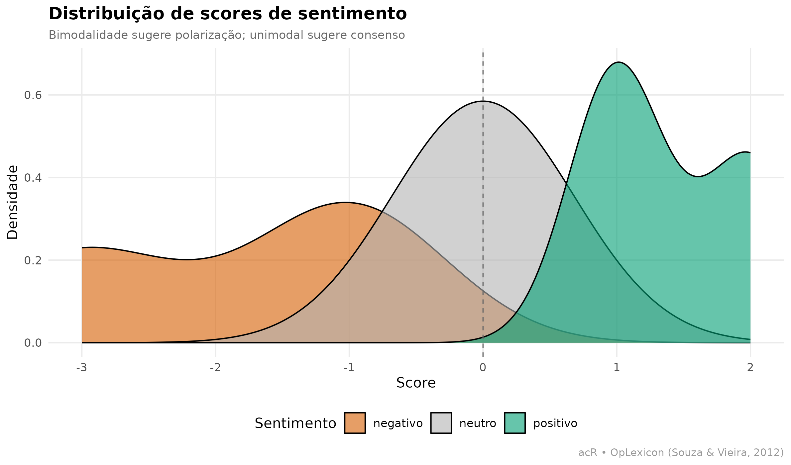
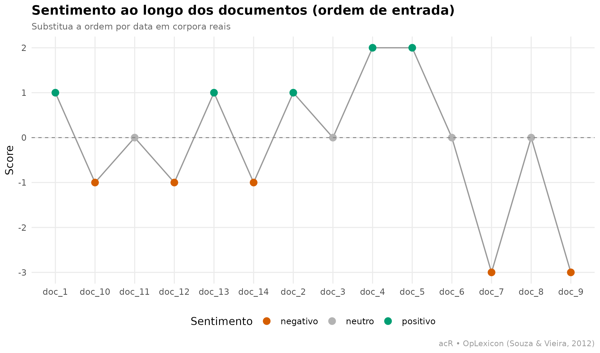
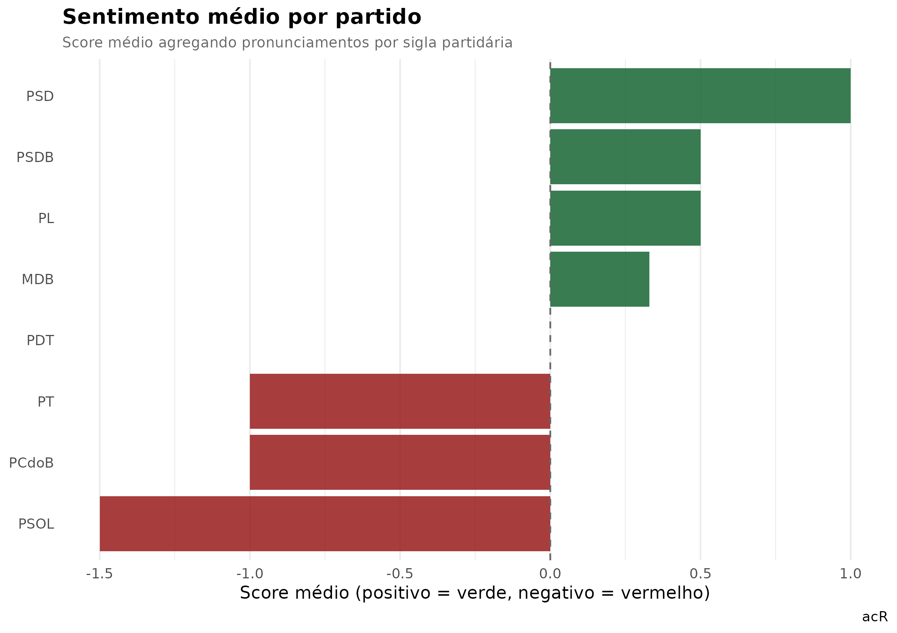
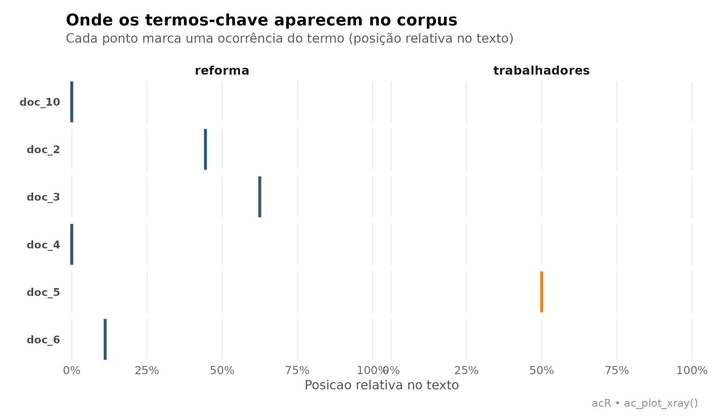

# Analise de sentimento

## O que é análise de sentimento com léxico

Análise de sentimento baseada em **léxico** classifica textos em
positivo, negativo ou neutro **contando palavras** de listas curadas:
palavras que carregam valência positiva (*excelente*, *aprovar*,
*conquista*) contra palavras de valência negativa (*péssimo*,
*fracasso*, *retrocesso*).

O `acR` usa por padrão o **OpLexicon** (Souza & Vieira, 2012), o mais
usado para português brasileiro, com cerca de 30 mil palavras rotuladas.

### Quando usar léxico vs. LLM?

| Cenário                          | Léxico | LLM            |
|----------------------------------|--------|----------------|
| Sinal grosso em milhares de docs | ✅     | ❌ caro        |
| Ironia, sarcasmo, contexto       | ❌     | ✅             |
| Sem chave de API, sem rede       | ✅     | ❌             |
| Precisa reprodutibilidade exata  | ✅     | ⚠️ estocástico |
| Documentos muito curtos (tweets) | ⚠️     | ✅             |

Regra prática: use léxico para **panorama rápido** e **filtragem de
casos extremos**, depois use codificação qualitativa (via
[`ac_qual_code()`](https://andersonheri.github.io/acR/reference/ac_qual_code.md))
na amostra que interessa.

``` r

library(acR)
library(dplyr)
#> 
#> Attaching package: 'dplyr'
#> The following objects are masked from 'package:stats':
#> 
#>     filter, lag
#> The following objects are masked from 'package:base':
#> 
#>     intersect, setdiff, setequal, union
```

## 1. Corpus: pronunciamentos sobre uma reforma polêmica

Corpus fabricado de 14 pronunciamentos, com metadados de partido e
posição declarada. Serve para exercitar visualizações; em corpora reais,
substitua pela coleta via
[`ac_fetch_camara()`](https://andersonheri.github.io/acR/reference/ac_fetch_camara.md)
ou
[`ac_fetch_senado()`](https://andersonheri.github.io/acR/reference/ac_fetch_senado.md).

``` r

textos <- c(
  # Favoráveis
  "Excelente proposta que moderniza o sistema e protege as geracoes futuras.",
  "Aprovamos com convicção esta reforma responsável e necessária ao país.",
  "Vitória histórica para a economia: reforma corrige distorções antigas.",
  "Reforma equilibrada garante sustentabilidade fiscal e futuro promissor.",
  "Conquista importante que beneficia trabalhadores e empresas do Brasil.",
  # Contrários
  "Esta reforma é um retrocesso vergonhoso que prejudica os trabalhadores.",
  "Voto contra: proposta desastrosa ataca os mais pobres e vulneráveis.",
  "Uma tragédia nacional: estão roubando direitos duramente conquistados.",
  "Rejeitamos com indignação essa proposta injusta e cruel com o povo.",
  "Reforma péssima que aprofunda desigualdades e destrói a proteção social.",
  # Neutros / técnicos
  "O texto substitutivo altera o artigo 201 da Constituição Federal.",
  "O relatório final incorporou emendas apresentadas em plenário.",
  "A comissão aprovou o parecer com dez votos a favor e oito contra.",
  "A proposta segue para votação na próxima sessão ordinária."
)

df <- data.frame(
  text     = textos,
  posicao  = c(rep("favor", 5), rep("contra", 5), rep("neutro", 4)),
  partido  = c("PT","PSD","PL","MDB","PSDB",
               "PSOL","PT","PDT","PSOL","PCdoB",
               "MDB","PSDB","PL","MDB"),
  stringsAsFactors = FALSE
)
corpus <- ac_corpus(df)
corpus
#> 
#> ── Corpus acR ──────────────────────────────────────────────────────────────────
#> • Documentos: 14
#> • Metadados: 2 colunas
#> • Idioma: "pt"
#> 
#> # A tibble: 14 × 4
#>   doc_id text                                                    posicao partido
#>   <chr>  <chr>                                                   <chr>   <chr>  
#> 1 doc_1  Excelente proposta que moderniza o sistema e protege a… favor   PT     
#> 2 doc_2  Aprovamos com convicção esta reforma responsável e nec… favor   PSD    
#> 3 doc_3  Vitória histórica para a economia: reforma corrige dis… favor   PL     
#> 4 doc_4  Reforma equilibrada garante sustentabilidade fiscal e … favor   MDB    
#> 5 doc_5  Conquista importante que beneficia trabalhadores e emp… favor   PSDB   
#> 6 doc_6  Esta reforma é um retrocesso vergonhoso que prejudica … contra  PSOL   
#> # ℹ 8 more rows
```

## 2. Sentimento por documento

[`ac_sentiment()`](https://andersonheri.github.io/acR/reference/ac_sentiment.md)
retorna um tibble com contagens de palavras positivas (`n_pos`),
negativas (`n_neg`) e neutras (`n_neu`), o `score` (n_pos − n_neg pelo
método padrão `sum`) e o rótulo categórico `sentiment`.

``` r

sent <- ac_sentiment(corpus)
sent
#> # A tibble: 14 × 6
#>    doc_id n_pos n_neg n_neu score sentiment
#>    <chr>  <int> <int> <int> <int> <chr>    
#>  1 doc_1      1     0    10     1 positivo 
#>  2 doc_10     0     1     9    -1 negativo 
#>  3 doc_11     0     0    10     0 neutro   
#>  4 doc_12     0     1     7    -1 negativo 
#>  5 doc_13     1     0    12     1 positivo 
#>  6 doc_14     0     1     8    -1 negativo 
#>  7 doc_2      1     0     9     1 positivo 
#>  8 doc_3      0     0     9     0 neutro   
#>  9 doc_4      2     0     6     2 positivo 
#> 10 doc_5      2     0     7     2 positivo 
#> 11 doc_6      1     1     8     0 neutro   
#> 12 doc_7      0     3     7    -3 negativo 
#> 13 doc_8      0     0     8     0 neutro   
#> 14 doc_9      0     3     9    -3 negativo
```

Cruzando com a posição declarada — o léxico “acerta”?

``` r

sent |>
  dplyr::left_join(df |> dplyr::mutate(doc_id = paste0("doc_", dplyr::row_number())),
                   by = "doc_id") |>
  dplyr::count(posicao, sentiment) |>
  tidyr::pivot_wider(names_from = sentiment, values_from = n, values_fill = 0L)
#> # A tibble: 3 × 4
#>   posicao negativo neutro positivo
#>   <chr>      <int>  <int>    <int>
#> 1 contra         3      2        0
#> 2 favor          0      1        4
#> 3 neutro         2      1        1
```

Léxico funciona bem para **posições explícitas** (favor/contra) com
vocabulário emotivo. Falha em textos técnicos-neutros, que tipicamente
misturam palavras positivas e negativas em proporção baixa.

## 3. Comparar métodos de agregação

Três métodos alteram como o `score` é calculado a partir das contagens:

- **`sum`** (padrão): `score = n_pos − n_neg`. Depende do tamanho do
  texto.
- **`mean`**: normaliza pelo número total de palavras. Comparável entre
  textos curtos e longos.
- **`ratio`**: `(n_pos − n_neg) / (n_pos + n_neg)`. Ignora palavras
  neutras, foca só na intensidade emotiva relativa.

``` r

sent_sum   <- ac_sentiment(corpus, method = "sum")
sent_mean  <- ac_sentiment(corpus, method = "mean")
sent_ratio <- ac_sentiment(corpus, method = "ratio")

comparacao <- data.frame(
  doc_id = sent_sum$doc_id,
  sum    = round(sent_sum$score,   2),
  mean   = round(sent_mean$score,  2),
  ratio  = round(sent_ratio$score, 2)
)
head(comparacao, 10)
#>    doc_id sum  mean ratio
#> 1   doc_1   1  0.09     1
#> 2  doc_10  -1 -0.10    -1
#> 3  doc_11   0  0.00     0
#> 4  doc_12  -1 -0.12    -1
#> 5  doc_13   1  0.08     1
#> 6  doc_14  -1 -0.11    -1
#> 7   doc_2   1  0.10     1
#> 8   doc_3   0  0.00     0
#> 9   doc_4   2  0.25     1
#> 10  doc_5   2  0.22     1
```

## 4. Visualização: barras por documento

``` r

ac_plot_sentiment(sent, type = "bar") +
  ggplot2::labs(
    title    = "Sentimento por documento",
    subtitle = "Contagem de palavras positivas vs. negativas (OpLexicon)",
    caption  = "acR - ac_plot_sentiment(type = \"bar\")"
  )
```



Padrão claro: os 5 primeiros documentos (favoráveis) verdes/positivos,
os 5 seguintes (contrários) vermelhos/negativos, os 4 últimos
(neutros/técnicos) cinza.

## 5. Visualização: distribuição (densidade)

Útil para ver **a forma da distribuição** — sentimento é bimodal (dois
picos, favor e contra) ou tem uma cauda longa?

``` r

ac_plot_sentiment(sent, type = "density") +
  ggplot2::labs(
    title    = "Distribuição de scores de sentimento",
    subtitle = "Bimodalidade sugere polarização; unimodal sugere consenso"
  )
```



## 6. Visualização: série ordenada

Se seus documentos têm ordem temporal (discursos ao longo do ano), a
série mostra tendência.

``` r

ac_plot_sentiment(sent, type = "line") +
  ggplot2::labs(
    title    = "Sentimento ao longo dos documentos (ordem de entrada)",
    subtitle = "Substitua a ordem por data em corpora reais"
  )
```



## 7. Agregação por grupo (partido)

A análise mais útil raramente é doc-a-doc: é comparar **grupos**. Vamos
agregar por partido:

``` r

por_partido <- sent |>
  dplyr::left_join(df |> dplyr::mutate(doc_id = paste0("doc_", dplyr::row_number())),
                   by = "doc_id") |>
  dplyr::group_by(partido) |>
  dplyr::summarise(
    n_docs     = dplyr::n(),
    score_med  = round(mean(score), 2),
    score_dp   = round(stats::sd(score, na.rm = TRUE), 2),
    n_positivo = sum(sentiment == "positivo"),
    n_negativo = sum(sentiment == "negativo"),
    n_neutro   = sum(sentiment == "neutro"),
    .groups    = "drop"
  ) |>
  dplyr::arrange(dplyr::desc(score_med))

por_partido
#> # A tibble: 8 × 7
#>   partido n_docs score_med score_dp n_positivo n_negativo n_neutro
#>   <chr>    <int>     <dbl>    <dbl>      <int>      <int>    <int>
#> 1 PSD          1      1       NA             1          0        0
#> 2 PL           2      0.5      0.71          1          0        1
#> 3 PSDB         2      0.5      2.12          1          1        0
#> 4 MDB          3      0.33     1.53          1          1        1
#> 5 PDT          1      0       NA             0          0        1
#> 6 PCdoB        1     -1       NA             0          1        0
#> 7 PT           2     -1        2.83          1          1        0
#> 8 PSOL         2     -1.5      2.12          0          1        1
```

Visualização (ranqueando partidos pelo score médio):

``` r

if (requireNamespace("ggplot2", quietly = TRUE)) {
  ggplot2::ggplot(
    por_partido,
    ggplot2::aes(x = stats::reorder(partido, score_med), y = score_med,
                 fill = score_med > 0)
  ) +
    ggplot2::geom_col(alpha = 0.85, show.legend = FALSE) +
    ggplot2::geom_hline(yintercept = 0, linetype = 2, color = "grey40") +
    ggplot2::coord_flip() +
    ggplot2::scale_fill_manual(values = c("TRUE" = "#166534", "FALSE" = "#991B1B")) +
    ggplot2::labs(
      title    = "Sentimento médio por partido",
      subtitle = "Score médio agregando pronunciamentos por sigla partidária",
      x        = NULL,
      y        = "Score médio (positivo = verde, negativo = vermelho)",
      caption  = "acR"
    ) +
    ggplot2::theme_minimal(base_size = 12) +
    ggplot2::theme(
      plot.title    = ggplot2::element_text(face = "bold"),
      plot.subtitle = ggplot2::element_text(color = "grey40", size = 10),
      panel.grid.major.y = ggplot2::element_blank()
    )
}
```



## 8. Termos-chave dentro do texto (X-ray)

[`ac_plot_xray()`](https://andersonheri.github.io/acR/reference/ac_plot_xray.md)
mostra **onde** termos-alvo aparecem dentro de cada documento. Útil para
ver se palavras negativas se concentram no começo, meio ou fim — sinal
de estrutura retórica.

``` r

ac_plot_xray(corpus, terms = c("reforma", "trabalhadores", "aprovar", "vergonha")) +
  ggplot2::labs(
    title    = "Onde os termos-chave aparecem no corpus",
    subtitle = "Cada ponto marca uma ocorrência do termo (posição relativa no texto)"
  )
#> Warning: Termo(s) sem ocorrencia: "aprovar" and "vergonha".
#> ℹ Verifique ortografia/acentuacao ou o efeito de `ac_clean()`.
```



## 9. Exportar para artigo/relatório

``` r

# Tabela por partido pronta para colar no LaTeX
ac_export(por_partido, arquivo = "sentimento_por_partido.tex", formato = "latex")

# CSV para Excel/planilha
ac_export(sent, arquivo = "sentimento.csv", formato = "csv")

# Se quiser passar para a etapa qualitativa (LLM):
# amostrar documentos ambíguos (perto de score = 0) para revisão humana
casos_limitrofes <- sent |> dplyr::filter(abs(score) <= 1)
```

## Referências

- Souza, M.; Vieira, R. (2012). Sentiment Analysis on Twitter with
  Portuguese Language. *4th Workshop on Computational Approaches to
  Subjectivity, Sentiment and Social Media Analysis*, PUCRS.
- Pang, B.; Lee, L. (2008). Opinion Mining and Sentiment Analysis.
  *Foundations and Trends in Information Retrieval*, 2(1-2), 1-135.
- Silge, J.; Robinson, D. (2017). *Text Mining with R*. O’Reilly.
- Sampaio, R. C.; Lycarião, D. (2021). *Análise de conteúdo categorial:
  manual de aplicação*. ENAP.
